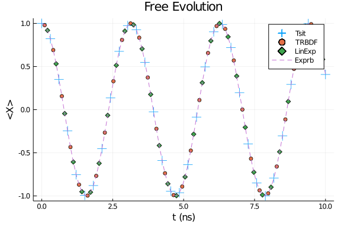

## Close System Examples
This notebook will get you started with OSQAT by introducing you to the functionality for solving closed system equations.

### Define the Hamiltonin
Let start with a 2-level system with Hamiltonian

$$H(s) = - \sigma_z$$

and initial state

$$\lvert \phi(0) \rangle = \lvert + \rangle \ ,$$

where $s$ is the dimensionless annealing parameter and is usually chosen as

$$s = t/t_f \ ,$$

where $t_f$ is the total evolution time. We use a constant Hamiltonian in this tutorial so we can trivially confirm the simulation result. However, the syntax will be the same for time dependent Hamiltonians. Let's first define the Hamiltonian by:

````julia
using QuantumAnnealingTools, OrdinaryDiffEq, Plots
# define the Hamiltonian
H = DenseHamiltonian([(s)->1.0], [-σz], unit=:ħ)
u0 = PauliVec[1][1]
# define total evolution time in (ns)
tf = 10
annealing = Annealing(H, u0)
````


````
Annealing with hType QTBase.DenseHamiltonian{Complex{Float64}} and uType Ar
ray{Complex{Float64},1}
u0 with size: (2,)
````


In this example, we use the `DenseHamiltonian` object. The syntax is the same for other type of Hamiltonians.

### Schrodinger equation
We start with the Schrodinger equation
\begin{equation}
    \lvert \dot{\phi} \rangle = -i t_f H(s) \lvert \phi \rangle \ .
\end{equation}

To solve the this differential equation, we need to choose a proper algortihm. OSQAT rely on `OrdinaryDiffEq.jl` as the low level solver, which support a large collection of [algorithms](https://docs.sciml.ai/latest/solvers/ode_solve/). We do not guarantee compatibilities to every solver in this list. Users can try specific algorithms if they are interested. We provide a list of algorithms we tested and recommended here:

1. The default Tsitouras 5/4 Runge-Kutta method(Tsit5()).  \
   This is the default method in `OrdinaryDiffEq` and works well in most cases.
 
2. A second order A-B-L-S-stable one-step ESDIRK method(TRBDF2()). \
   This is the method widely used in large scale classical circuit simulations. Because this method has order of 2, it is recommended to use smaller error tolerance comparing with other higher order methods.
 
3. A simple linear exponential method(LinearExponential()). \
   This method simply discretize the Hamiltonian and do matrix exponential for each interval.
 
4. Adaptive exponential Rosenbrock methods(Exprb32()/Exprb43()). \
   This method belongs to the adaptive exponential Runge-Kutta method family.
 
It is important to notice that, method 3 and 4 are exponential methods which would preserve the norm of the state vectors. To solve our the Schrodinger equation we use the command `solve_schrodinger`.

````julia
sol_tsit = solve_schrodinger(annealing, tf, alg=Tsit5(), abstol=1e-6, reltol=1e-6);
sol_trbdf = solve_schrodinger(annealing, tf, alg=TRBDF2(), abstol=1e-6, reltol=1e-6);
# LinearExponential is a fixed step size method, user need to specify the time steps using keyword argument `tstops`.
sol_linexp = solve_schrodinger(annealing, tf, alg=LinearExponential(), abstol=1e-6, reltol=1e-6, tstops=range(0,tf,length=100));
# Even though Exprb method is an adaptive method, it tends to jump a lot of middle points. So if you want accurate evolution in the middle,
# it is better to manually add more points for the algorithm.
sol_exprb32 = solve_schrodinger(annealing, tf, alg=Exprb32(), tstops=range(0,tf,length=100));
````


````
retcode: Success
Interpolation: 3rd order Hermite
t: 101-element Array{Float64,1}:
  0.0
  0.02155449821897047
  0.10101010101010101
  0.20202020202020202
  0.30303030303030304
  0.40404040404040403
  0.5050505050505051
  0.6060606060606061
  0.7070707070707071
  0.8080808080808081
  ⋮
  9.191919191919192
  9.292929292929292
  9.393939393939394
  9.494949494949495
  9.595959595959595
  9.696969696969697
  9.797979797979798
  9.8989898989899
 10.0
u: 101-element Array{Array{Complex{Float64},1},1}:
 [0.7071067811865475 + 0.0im, 0.7071067811865475 + 0.0im]
 [0.7069425279158157 + 0.015240151705153755im, 0.7069425279158157 - 0.01524
0151705153755im]
 [0.7035025277139556 + 0.0713035307686447im, 0.7035025277139556 - 0.0713035
307686447im]
 [0.6927265103834769 + 0.14188016708451748im, 0.6927265103834769 - 0.141880
16708451748im]
 [0.6748885838844382 + 0.21101042472460332im, 0.6748885838844382 - 0.211010
42472460332im]
 [0.6501705946090355 + 0.2779895643827896im, 0.6501705946090355 - 0.2779895
643827896im]
 [0.6188245268432399 + 0.3421347760418987im, 0.6188245268432399 - 0.3421347
760418987im]
 [0.5811699339461844 + 0.40279213979047235im, 0.5811699339461844 - 0.402792
13979047235im]
 [0.5375906807055341 + 0.45934329212317915im, 0.5375906807055341 - 0.459343
29212317915im]
 [0.48853103007846754 + 0.5112117297661226im, 0.48853103007846754 - 0.51121
17297661226im]
 ⋮
 [-0.6880224515362771 + 0.16317201408946222im, -0.6880224515362771 - 0.1631
7201408946222im]
 [-0.7009694825372761 + 0.0929611991716103im, -0.7009694825372761 - 0.09296
11991716103im]
 [-0.7067705724758054 + 0.021802703553061978im, -0.7067705724758054 - 0.021
802703553061978im]
 [-0.7053665829045693 - 0.04957805685514289im, -0.7053665829045693 + 0.0495
7805685514289im]
 [-0.6967718266103273 - 0.12045340029284536im, -0.6967718266103273 + 0.1204
5340029284536im]
 [-0.6810739217040739 - 0.19010079740662192im, -0.6810739217040739 + 0.1901
0079740662192im]
 [-0.6584328984097478 - 0.25781023698010735im, -0.6584328984097478 + 0.2578
1023698010735im]
 [-0.6290795676571904 - 0.32289146404983027im, -0.6290795676571904 + 0.3228
9146404983027im]
 [-0.5933131681105249 - 0.38468101661851273im, -0.5933131681105249 + 0.3846
8101661851273im]
````


We plot the observable $\langle X \rangle$ during the evolution.
````julia
t_list = range(0,tf,length=100)
tsit = []
trbdf = []
linexp = []
exprb32 = []
for s in t_list
    push!(tsit, real(sol_tsit(s)'*σx*sol_tsit(s)))
    push!(trbdf, real(sol_trbdf(s)'*σx*sol_trbdf(s)))
    push!(linexp, real(sol_linexp(s)'*σx*sol_linexp(s)))
    push!(exprb32, real(sol_exprb32(s)'*σx*sol_exprb32(s)))
end
scatter(t_list[1:3:end], tsit[1:3:end], label="Tsit", marker=:+, markersize=8)
scatter!(t_list[2:3:end], trbdf[2:3:end], label="TRBDF")
scatter!(t_list[3:3:end], linexp[3:3:end], label="LinExp", marker=:d)
plot!(t_list, exprb32, label="Exprb", linestyle=:dash)
xlabel!("t (ns)")
ylabel!("<X>")
title!("Free Evolution")
````





### Other close system equations
The package also contains several other close system tools.
#### Von Neumann equation
Von Neumann equation is the "Schrodinger" equation for density matrices

$$\dot{\rho} = -it_f[H(s), \rho] \ .$$

Even though Von Neumann equation is equivalent to the Schrodinger equation, it is sometimes numerically more stable than the Schrodinger equation. Users is encouraged to try to solve them using different algorithms.

````julia
annealing = Annealing(H, u0)
sol_tsit = solve_von_neumann(annealing, tf, alg=Tsit5(), abstol=1e-6, reltol=1e-6)
````


````
retcode: Success
Interpolation: specialized 4th order "free" interpolation
t: 78-element Array{Float64,1}:
  0.0
  0.025416471135423512
  0.07162657822452011
  0.12691325854682373
  0.19490751014915958
  0.2726355853793798
  0.3605272018981224
  0.4567317871059021
  0.5605609353632346
  0.6707029681719032
  ⋮
  8.93912030993445
  9.07904338542158
  9.218966473882144
  9.358889575316146
  9.498812680456844
  9.63873579857098
  9.778658911125072
  9.91858201811912
 10.0
u: 78-element Array{Array{Complex{Float64},2},1}:
 [0.4999999999999999 + 0.0im 0.4999999999999999 + 0.0im; 0.4999999999999999
 + 0.0im 0.4999999999999999 + 0.0im]
 [0.4999999999999999 + 0.0im 0.4993541420867104 + 0.025405526573483335im; 0
.4993541420867104 - 0.025405526573483335im 0.4999999999999999 + 0.0im]
 [0.4999999999999999 + 0.0im 0.49487840083247414 + 0.07138184906644161im; 0
.49487840083247414 - 0.07138184906644161im 0.4999999999999999 + 0.0im]
 [0.4999999999999999 + 0.0im 0.4839793174578459 + 0.12555484945742712im; 0.
4839793174578459 - 0.12555484945742712im 0.4999999999999999 + 0.0im]
 [0.4999999999999999 + 0.0im 0.46248968537194657 + 0.19000865966633518im; 0
.46248968537194657 - 0.19000865966633518im 0.4999999999999999 + 0.0im]
 [0.4999999999999999 + 0.0im 0.427493339167494 + 0.25932497858582826im; 0.4
27493339167494 - 0.25932497858582826im 0.4999999999999999 + 0.0im]
 [0.4999999999999999 + 0.0im 0.37555502540351415 + 0.3300885061538326im; 0.
37555502540351415 - 0.3300885061538326im 0.4999999999999999 + 0.0im]
 [0.4999999999999999 + 0.0im 0.30550378150848995 + 0.39581237672432157im; 0
.30550378150848995 - 0.39581237672432157im 0.4999999999999999 + 0.0im]
 [0.4999999999999999 + 0.0im 0.2173361827963109 + 0.450294326336122im; 0.21
73361827963109 - 0.450294326336122im 0.4999999999999999 + 0.0im]
 [0.4999999999999999 + 0.0im 0.1136919542765893 + 0.48690259218729237im; 0.
1136919542765893 - 0.48690259218729237im 0.4999999999999999 + 0.0im]
 ⋮
 [0.4999999999999999 + 0.0im 0.2821075428516711 - 0.4128134549525757im; 0.2
821075428516711 + 0.4128134549525757im 0.4999999999999999 + 0.0im]
 [0.4999999999999999 + 0.0im 0.3851552754690851 - 0.31883384596677317im; 0.
3851552754690851 + 0.31883384596677317im 0.4999999999999999 + 0.0im]
 [0.4999999999999999 + 0.0im 0.45823633996555163 - 0.200047638132882im; 0.4
5823633996555163 + 0.200047638132882im 0.4999999999999999 + 0.0im]
 [0.4999999999999999 + 0.0im 0.495664718569642 - 0.06569688565511998im; 0.4
95664718569642 + 0.06569688565511998im 0.4999999999999999 + 0.0im]
 [0.4999999999999999 + 0.0im 0.49452831997779884 + 0.07376535766452093im; 0
.49452831997779884 - 0.07376535766452093im 0.4999999999999999 + 0.0im]
 [0.4999999999999999 + 0.0im 0.4549155549065751 + 0.20748835723339634im; 0.
4549155549065751 - 0.20748835723339634im 0.4999999999999999 + 0.0im]
 [0.4999999999999999 + 0.0im 0.3799084648348192 + 0.3250678883897251im; 0.3
799084648348192 - 0.3250678883897251im 0.4999999999999999 + 0.0im]
 [0.4999999999999999 + 0.0im 0.27534291888307516 + 0.4173557762487382im; 0.
27534291888307516 - 0.4173557762487382im 0.4999999999999999 + 0.0im]
 [0.4999999999999999 + 0.0im 0.20403994993813426 + 0.45647263381364406im; 0
.20403994993813426 - 0.45647263381364406im 0.4999999999999999 + 0.0im]
````


As shown below, the solution given by the solver is the density matrix instead of state vector:

````julia
sol_tsit(0.5)
````


````
2×2 Array{Complex{Float64},2}:
      0.5+0.0im       0.270151+0.420736im
 0.270151-0.420736im       0.5+0.0im
````


##### Recommended algorithm
Only explicit methods are supported for solving equations w.r.t. density matrices. [Vectorization] (https://en.wikipedia.org/wiki/Vectorization_(mathematics)) is needed for implicit methods. This can be done by setting `vectorize` keyword argument to be true. For example, in the following block, we solve the Von Neumann equation with TRBDF2 method:

````julia
sol_bdf = solve_von_neumann(annealing, tf, alg=TRBDF2(), reltol=1e-6, vectorize=true)
sol_bdf(0.5 * tf)
````


````
4-element Array{Complex{Float64},1}:
  0.4999999999999999 + 0.0im
 -0.4214558175232074 + 0.26894060674187487im
 -0.4214558175232074 - 0.26894060674187487im
  0.4999999999999999 + 0.0im
````


As shown above, the solution given by the solver becomes a vectorized version of the density matrix.

Side note: `TRBDF2` can actually work without vectorizing the Von Neumann equation. However, this is not generally true for other algorithms/solvers. For example, we will run into error for `LinearExponential` method if no vectorization is performed:

````julia
sol_linexp = solve_von_neumann(annealing, tf, alg=LinearExponential(), tstops=range(0,tf,length=100));
````


````
Error: MethodError: no method matching Array{T,2} where T(::QuantumAnnealin
gTools.var"#35#39")
Closest candidates are:
  Array{T,2} where T(!Matched::LinearAlgebra.SymTridiagonal{T,V} where V<:A
bstractArray{T,1}) where T at D:\Julia-1.5.0\share\julia\stdlib\v1.5\Linear
Algebra\src\tridiag.jl:141
  Array{T,2} where T(!Matched::LinearAlgebra.Tridiagonal{T,V} where V<:Abst
ractArray{T,1}) where T at D:\Julia-1.5.0\share\julia\stdlib\v1.5\LinearAlg
ebra\src\tridiag.jl:582
  Array{T,2} where T(!Matched::LinearAlgebra.LowerTriangular{T,S} where S<:
AbstractArray{T,2}) where T at D:\Julia-1.5.0\share\julia\stdlib\v1.5\Linea
rAlgebra\src\triangular.jl:34
  ...
````


````julia
sol_linexp = solve_von_neumann(annealing, tf, alg=LinearExponential(), tstops=range(0,tf,length=100), vectorize=true);
````


````
retcode: Success
Interpolation: 3rd order Hermite
t: 100-element Array{Float64,1}:
  0.0
  0.10101010101010101
  0.20202020202020202
  0.30303030303030304
  0.40404040404040403
  0.5050505050505051
  0.6060606060606061
  0.7070707070707071
  0.8080808080808081
  0.9090909090909091
  ⋮
  9.191919191919192
  9.292929292929292
  9.393939393939394
  9.494949494949495
  9.595959595959595
  9.696969696969697
  9.797979797979798
  9.8989898989899
 10.0
u: 100-element Array{Array{Complex{Float64},1},1}:
 [0.4999999999999999 + 0.0im, 0.4999999999999999 + 0.0im, 0.499999999999999
9 + 0.0im, 0.4999999999999999 + 0.0im]
 [0.4999999999999999 + 0.0im, 0.4898316129998498 - 0.10032442826134269im, 0
.4898316129998498 + 0.10032442826134269im, 0.4999999999999999 + 0.0im]
 [0.4999999999999999 + 0.0im, 0.45974003637613875 - 0.19656830607416487im, 
0.45974003637613875 + 0.19656830607416487im, 0.4999999999999999 + 0.0im]
 [0.4999999999999999 + 0.0im, 0.410949201315085 - 0.28481705345448277im, 0.
410949201315085 + 0.28481705345448277im, 0.4999999999999999 + 0.0im]
 [0.4999999999999999 + 0.0im, 0.3454436041885337 - 0.3614812807397302im, 0.
3454436041885337 + 0.3614812807397302im, 0.4999999999999999 + 0.0im]
 [0.4999999999999999 + 0.0im, 0.2658875900455196 - 0.4234427818014917im, 0.
2658875900455196 + 0.4234427818014917im, 0.4999999999999999 + 0.0im]
 [0.4999999999999999 + 0.0im, 0.1755169842460251 - 0.4681813625521424im, 0.
1755169842460251 + 0.4681813625521424im, 0.4999999999999999 + 0.0im]
 [0.4999999999999999 + 0.0im, 0.07800747996287927 - 0.493877346180042im, 0.
07800747996287927 + 0.493877346180042im, 0.4999999999999999 + 0.0im]
 [0.4999999999999999 + 0.0im, -0.02267486530094263 - 0.49948558586167846im,
 -0.02267486530094263 + 0.49948558586167846im, 0.4999999999999999 + 0.0im]
 [0.4999999999999999 + 0.0im, -0.1224349433425395 - 0.4847779745911619im, -
0.1224349433425395 + 0.4847779745911619im, 0.4999999999999999 + 0.0im]
 ⋮
 [0.4999999999999999 + 0.0im, 0.4467497876359766 + 0.22453201831188785im, 0
.4467497876359766 - 0.22453201831188785im, 0.4999999999999999 + 0.0im]
 [0.4999999999999999 + 0.0im, 0.4827164308971524 + 0.1303259273587371im, 0.
4827164308971524 - 0.1303259273587371im, 0.4999999999999999 + 0.0im]
 [0.4999999999999999 + 0.0im, 0.49904928423555467 + 0.030819018543436303im,
 0.49904928423555467 - 0.030819018543436303im, 0.4999999999999999 + 0.0im]
 [0.4999999999999999 + 0.0im, 0.4950840325569366 - 0.06994140910192062im, 0
.4950840325569366 + 0.06994140910192062im, 0.4999999999999999 + 0.0im]
 [0.4999999999999999 + 0.0im, 0.4709819567157834 - 0.16785707148694098im, 0
.4709819567157834 + 0.16785707148694098im, 0.4999999999999999 + 0.0im]
 [0.4999999999999999 + 0.0im, 0.42772337365073343 - 0.25894539121759863im, 
0.42772337365073343 + 0.25894539121759863im, 0.4999999999999999 + 0.0im]
 [0.4999999999999999 + 0.0im, 0.36706776341652236 - 0.3395014831490315im, 0
.36706776341652236 + 0.3395014831490315im, 0.4999999999999999 + 0.0im]
 [0.4999999999999999 + 0.0im, 0.2914822048875151 - 0.4062488452093284im, 0.
2914822048875151 + 0.4062488452093284im, 0.4999999999999999 + 0.0im]
 [0.4999999999999999 + 0.0im, 0.20404103090669592 - 0.45647262536381406im, 
0.20404103090669592 + 0.45647262536381406im, 0.4999999999999999 + 0.0im]
````


We can again plot the $\langle X \rangle$ for different methods

````julia
sol_tsit = solve_von_neumann(annealing, tf, alg=Tsit5(), reltol=1e-6);
sol_trbdf = solve_von_neumann(annealing, tf, alg=TRBDF2(), reltol=1e-6);
# LinearExponential is a fixed step size method, user need to specify the time steps using keyword argument `tstops`.
sol_linexp = solve_von_neumann(annealing, tf, alg=LinearExponential(), tstops=range(0,tf,length=100), vectorize=true);
# Even though Exprb method is an adaptive method, it tends to jump a lot of middle points. So if you want accurate evolution in the middle,
# it is better to manually add more points for the algorithm.
sol_exprb32 = solve_von_neumann(annealing, tf, alg=Exprb32(), tstops=range(0,tf,length=100), vectorize=true);

t_list = range(0,tf,length=100)
tsit = []
trbdf = []
linexp = []
exprb32 = []
for s in t_list
    push!(tsit, real(tr(sol_tsit(s)*σx)))
    push!(trbdf, real(tr(sol_trbdf(s)*σx)))
    push!(linexp, real(tr(σx*reshape(sol_linexp(s),2,2))))
    push!(exprb32, real(tr(σx*reshape(sol_exprb32(s),2,2))))
end
scatter(t_list[1:3:end], tsit[1:3:end], label="Tsit", marker=:+, markersize=8)
scatter!(t_list[2:3:end], trbdf[2:3:end], label="TRBDF")
scatter!(t_list[3:3:end], linexp[3:3:end], label="LinExp", marker=:d)
plot!(t_list, exprb32, label="Exprb", linestyle=:dash)
xlabel!("t (ns)")
ylabel!("<X>")
title!("Free Evolution")
````


#### Unitary
Lastly, we can also solve the unitary

$$U(s) = T_+ \exp\bigg\{ -i t_f \int_0^s H(s') \mathrm{d}s' \bigg\}$$

using `solve_unitary`. The ODE form of the problem is

$$\dot{U} = -i t_f H(s) U \ .$$

Again, although this is in principle equivalent to Schrondinger/Von Neumann equation, the unitary becomes handy in certain cases, e.g. the Redfeild equation.

````julia
annealing = Annealing(H, u0)
sol_tsit = solve_unitary(annealing, tf, alg=Tsit5(),abstol=1e-6, reltol=1e-6)
sol_tsit(0.5 * tf)
````


````
2×2 Array{Complex{Float64},2}:
 0.283662-0.958924im       0.0+0.0im
      0.0+0.0im       0.283662+0.958924im
````


Again we plot the $\langle X \rangle$ obtained by multiplying the unitary with the initial state.

````julia
sol_tsit = solve_unitary(annealing, tf, alg=Tsit5(), reltol=1e-6);
sol_trbdf = solve_unitary(annealing, tf, alg=TRBDF2(), reltol=1e-6, vectorize=true);
# LinearExponential is a fixed step size method, user need to specify the time steps using keyword argument `tstops`.
sol_linexp = solve_unitary(annealing, tf, alg=LinearExponential(), tstops=range(0,tf,length=100), vectorize=true);
# Even though Exprb method is an adaptive method, it tends to jump a lot of middle points. So if you want accurate evolution in the middle,
# it is better to manually add more points for the algorithm.
sol_exprb32 = solve_unitary(annealing, tf, alg=Exprb32(), tstops=range(0,tf,length=100), vectorize=true);

t_list = range(0,tf,length=100)
tsit = []
trbdf = []
linexp = []
exprb32 = []
for s in t_list
    state_tsit = sol_tsit(s) * u0
    state_trbdf = reshape(sol_trbdf(s), 2, 2) * u0
    state_linexp = reshape(sol_linexp(s), 2, 2) * u0
    state_exprb32 = reshape(sol_exprb32(s), 2, 2) * u0
    push!(tsit, real(state_tsit' * σx * state_tsit))
    push!(trbdf, real(state_trbdf' * σx * state_trbdf))
    push!(linexp, real(state_linexp' * σx * state_linexp))
    push!(exprb32, real(state_exprb32' * σx * state_exprb32))
end
scatter(t_list[1:3:end], tsit[1:3:end], label="Tsit", marker=:+, markersize=8)
scatter!(t_list[2:3:end], trbdf[2:3:end], label="TRBDF")
scatter!(t_list[3:3:end], linexp[3:3:end], label="LinExp", marker=:d)
plot!(t_list, exprb32, label="Exprb", linestyle=:dash)
xlabel!("t (ns)")
ylabel!("<X>")
title!("Free Evolution")
````


