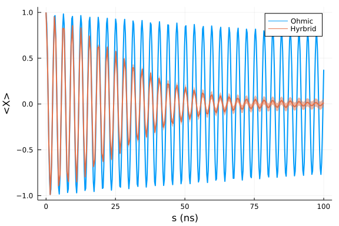

## Model setup
The spin-fluctuator model is a way to model 1/f noise in solid-state systems. Interested readers can find more information in this [review paper](https://journals.aps.org/rmp/abstract/10.1103/RevModPhys.86.361) as well as in Ka-Wa Yip's [thesis](https://github.com/USCqserver/1fnoise/blob/master/Kawa_Yip_thesis.pdf). Ka-Wa's MATLAB program is also available in this [1fnoise](https://github.com/USCqserver/1fnoise) repo.

In this tutorial, we solve a master equation of the form

$$\dot{\rho} = - i [-Z + \delta(s)Z, \rho] + \mathcal{L}(\rho)$$

via the quantum trajectories method. In the above expression, $\mathcal{L}$ is the Davies generator from the adiabatic master equation. $\delta(s)$ is a classical stochastic process generated by summing multiple telegraph processes:

$$\delta(t) = \sum_{i=1}^N T_i(t) \ ,$$

where $T_i(t)$ switches randomly between $\pm b_i$​ with a rate $\gamma_i$​. In the following code block, we show how to construct such a process:

```julia
using OrdinaryDiffEq, OpenQuantumTools
using Plots, StatsBase

H = DenseHamiltonian([(s)->1.0], [-σz], unit=:ħ)
u0 = PauliVec[1][1]

coupling = ConstantCouplings(["Z"], unit=:ħ)
# number of fluctuators
num = 10
# The values of b created here are in angular frequency units:
bvec = 0.01 * ones(num)
# γᵢ
γvec = log_uniform(0.01, 1, num)
# create the fluctuator coupling interaction
fluctuator_ensemble = EnsembleFluctuator(bvec, γvec);
interaction_fluctuator = Interaction(coupling, fluctuator_ensemble)
# create the Ohmic coupling interaction
ohmic_bath = Ohmic(1e-4, 4, 16)
interaction_ohmic = Interaction(coupling, ohmic_bath)
# merge these two bath objects into `InteractionSet`
interactions = InteractionSet(interaction_fluctuator, interaction_ohmic)
annealing = Annealing(H, u0, interactions=interactions)
```

```
Annealing with OpenQuantumBase.DenseHamiltonian{ComplexF64} and u0 Vector{C
omplexF64}
u0 size: (2,)
```


## Dynamics
We solve the dynamics and calculate $\langle X \rangle$ during the evolution:

```julia
tf = 100
prob = build_ensembles(annealing, tf, :ame, ω_hint = range(-2, 2, length=100))
t_list = range(0,tf,length=200)
sol = solve(prob, Tsit5(), EnsembleSerial(), trajectories=1000, reltol=1e-6, saveat=t_list)

dataset = []
st(s, so) = normalize(so(s, continuity=:left))
for s in t_list
    push!(dataset, [real(st(s, so)' * σx * st(s, so)) for so in sol])
end

pop_mean = []
pop_rmse = []
for data in dataset
    p_mean = sum(data)/1000
    p_rmse = sqrt(sum((x)->(x-p_mean)^2, data))/1000
    push!(pop_mean, p_mean)
    push!(pop_rmse, 2*p_rmse)
end
```


We also solve the dynamics with a pure Ohmic bath, i.e., the adiabatic master equation:

```julia
a_list = range(0,tf,length=400)
annealing_ame = Annealing(H, u0, coupling=coupling, bath=ohmic_bath)
sol_ame = solve_ame(annealing_ame, tf, alg=Tsit5(), ω_hint = range(-2, 2, length=100), 
    reltol=1e-6, saveat=a_list)
ame_x = [real(tr(u*σx)) for u in sol_ame.u]
```


We compare $\langle X \rangle$ obtained using the above two models:

```julia
plot(a_list, ame_x, label="Ohmic", linewidth=2)
plot!(t_list, pop_mean, ribbon=pop_rmse, label="Hyrbrid", linewidth=2)
xlabel!("s (ns)")
ylabel!("<X>")
```




## Appendix
 This tutorial is part of the HOQSTTutorials.jl repository, found at: <https://github.com/USCqserver/HOQSTTutorials.jl>.

To locally run this tutorial, do the following commands:
```
using HOQSTTutorials
HOQSTTutorials.weave_file("advanced","01-ame_spin_fluctuators.jmd")
```

Computer Information:
```
Julia Version 1.6.1
Commit 6aaedecc44 (2021-04-23 05:59 UTC)
Platform Info:
  OS: Windows (x86_64-w64-mingw32)
  CPU: Intel(R) Core(TM) i7-6700K CPU @ 4.00GHz
  WORD_SIZE: 64
  LIBM: libopenlibm
  LLVM: libLLVM-11.0.1 (ORCJIT, skylake)

```

Package Information:

```
Status `tutorials\advanced\Project.toml`
[e429f160-8886-11e9-20cb-0dbe84e78965] OpenQuantumTools 0.6.3
[2913bbd2-ae8a-5f71-8c99-4fb6c76f3a91] StatsBase 0.33.8
[de0858da-6303-5e67-8744-51eddeeeb8d7] Printf nothing
[429524aa-4258-5aef-a3af-852621145aeb] Optim 1.3.0
[1dea7af3-3e70-54e6-95c3-0bf5283fa5ed] OrdinaryDiffEq 5.60.0
[91a5bcdd-55d7-5caf-9e0b-520d859cae80] Plots 1.19.2
```
