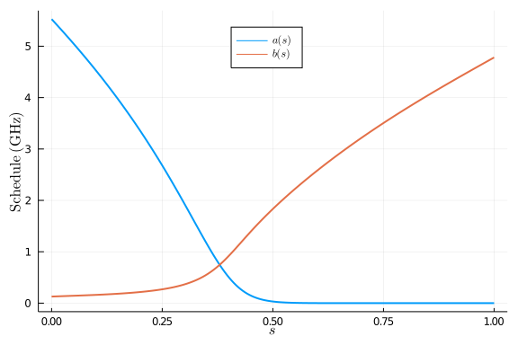
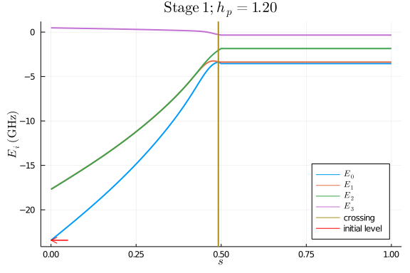
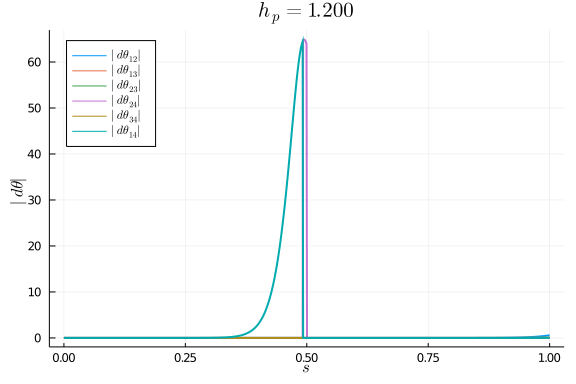
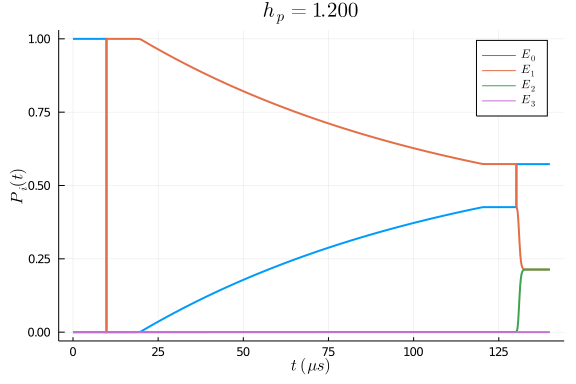
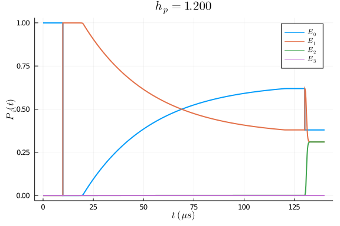

This tutorial illustrates how to simulate the 3-qubit entanglement experiment examined in [[1] Reexamination of the Evidence for Entanglement in a Quantum Annealer](https://link.aps.org/doi/10.1103/PhysRevA.92.062328) and the HOQST paper. We assume that our readers already have some knowledge of this experiment and HOQST. If not, we strongly recommend readers to first go through the references and introductory tutorials.

To make this tutorial less bulky, we also move most of the source code into [modules/3\_qubit\_entanglement](https://github.com/USCqserver/HOQSTTutorials.jl/tree/master/modules/3_qubit_entanglement) folder. Interested readers can look into the source files for more details.

## Annealing schedules
First, we load all necessary files and packages:
```julia
using OpenQuantumTools, OrdinaryDiffEq, Plots, LaTeXStrings
using Optim, Printf
# schedules.jl defines the annealing schedules
include("../../modules/3_qubit_entanglement/schedules.jl")
# hamiltonians.jl contains functions to construct the Hamiltonians
include("../../modules/3_qubit_entanglement/hamiltonians.jl")
# couplings.jl contains functions to construct the system-bath coupling operators
include("../../modules/3_qubit_entanglement/couplings.jl")
# evolutions.jl contains functions to construct the `Annealing` object
include("../../modules/3_qubit_entanglement/evolutions.jl")
```


We plot the annealing schedules used in this experiment:
```julia
s_axis = range(0, 1, length=200)
plot(
    s_axis,
    [A.(s_axis) B.(s_axis)] / 2 / π,
    linewidth=2,
    label=[L"a(s)" L"b(s)"],
    ylabel=L"\mathrm{Schedule}\ (\mathrm{GHz})",
    xlabel=L"s",
    legend=(0.5, 0.9);
)
```




## Adiabatic frame
To keep the running time reasonably short for this tutorial, we only solve the adiabatic master equation and adiabatic PTRE in the adiabatic frame. For readers who are not familiar with the adiabatic frame, [[2] Why and When Pausing Is Beneficial in Quantum Annealing](https://link.aps.org/doi/10.1103/PhysRevApplied.14.014100) contains a brief description of it. The readers are encouraged to try solving the dynamics in the original frame. It will take around 3 hours to complete the simulation of a single evolution.

For some choices of $h_p$ values, there are two level crossings during the evolution. We approximate those level crossings as instantaneous pulses in the adiabatic frame. Besides, we ignore all the geometric terms in the adiabatic frame because they scale inversely proportional to the total evolution time and are very small in our case. To illustrate this point, we first plot the Hamiltonian spectrum(the lowest 4 levels) during the first stage of the evolution:
```julia
# hp value for the instance
hp = 1.2
# construct the Hamiltonian
# the second argument is the stage number
H = build_H(hp, 1)
# get the energy level of the initial state
ilvl = init_lvl(hp)
s_list = range(0, 1, length=201) 
ev = []
for s in s_list
    w, = eigen_decomp(H, s, lvl=4)
    push!(ev, w)
end
gap_lvl = ilvl == 1 ? 1 : 2
sm, vm = min_gap(H, gap_lvl, gap_lvl+1)
# create a plot
p1 = plot(s_list, hcat(ev...)', label=[L"E_0" L"E_1" L"E_2" L"E_3"], linewidth=2, xlabel=L"s", ylabel=L"E_i\ (\mathrm{GHz})", 
    legend=:bottomright, title=latexstring(@sprintf("\\mathrm{Stage\\ 1}; h_p=%.2f", hp)))
# add a tracking line
sm <= 0.5 && !(hp == 1.8) ? vline!(p1, [sm], label="crossing", linewidth=2) : nothing
plot!(p1, [0.05, 0.0], [ev[1][ilvl], ev[1][ilvl]], arrow=0.4, color=:red, label="initial level")
```




Second, we plot the amplitude of the geometric terms in the adiabatic frame. There will be a bunch of warnings when the following code block is executed. This is because some energy levels become so close to each other during the evolution (either because $a(t)$ becomes very small or there is actually a level crossing) that the current algorithm may not be accurate in those regions. It is fine to ignore those warnings in this particular example. The level crossings (delta functions in adiabatic frame) are not captured by the algorithm but will be manually added when we perform the simulations.
```julia
dH = build_dH(hp, 1)
coupling = ConstantCouplings(["ZII", "IZI", "IIZ"], unit=:ħ)
s_axis = range(0, 1, length=1000)

proj = project_to_lowlevel(H, s_axis, coupling, dH, lvl=5, direction=:backward)
p1 = plot(s_axis, abs.(get_dθ(proj, 1, 2)), legend=:topleft, linewidth=2, label=L"|d\theta_{12}|", ylims=[0,65], ylabel=L"|d\theta|", xlabel=L"s")
plot!(p1, s_axis, abs.(get_dθ(proj, 1, 3)), linewidth=2, label=L"|d\theta_{13}|")
plot!(p1, s_axis, abs.(get_dθ(proj, 2, 3)), linewidth=2, label=L"|d\theta_{23}|")
plot!(p1, s_axis, abs.(get_dθ(proj, 2, 4)), linewidth=2, label=L"|d\theta_{24}|")
plot!(p1, s_axis, abs.(get_dθ(proj, 3, 4)), linewidth=2, label=L"|d\theta_{34}|")
plot!(p1, s_axis, abs.(get_dθ(proj, 1, 4)), linewidth=2, label=L"|d\theta_{14}|")

title!(p1, latexstring(@sprintf "h_p = %.3f" hp))
```




When divided by the total evolution time of the first stage $\tau_1$, these geometric terms are small compared with the energy gaps. The same argument applies to stage 3 of the evolution because these two stages are symmetrical to each other. Additionally, since stage 2 has a constant Hamiltonian, the geometric terms are 0. In conclusion, it is safe to ignore all the geometric terms during the entire evolution.

## Dynamics
Finally, we solve the open system dynamics using two different types of master equations. More details about the master equations and corresponding model parameters can be found in the HOQST paper.
### Adiabatic master equation
```julia
# define Ohmic bath
bath = Ohmic(1.2732e-4, 4, 12.5)
# construct the Hamiltonian H, system-bath couplings C and
# instantaneous pulse control callback cb for each stage of
# the experiment
# solve stage 1
H, C, cb = build_adiabatic_frame_evolution(hp, 1)
C = C[1]
u1 = build_adiabatic_frame_u0(hp)
annealing = Annealing(H, u1, coupling=C, bath=bath)
sol1 = solve_ame(annealing, 2 * τ1, ω_hint=range(-15, 15, length=200), alg=Tsit5(), reltol=1e-6, callback=cb, saveat=range(0,2*τ1,length=100))

# solve stage 2
# with τ2 given by
τ2 = 1e5
u2 = sol1[end]
H, C, cb = build_adiabatic_frame_evolution(hp, 2)
C = C[1]
annealing = Annealing(H, u2, coupling=C, bath=bath)
sol2 =  solve_ame(annealing, τ2, ω_hint = range(-15, 15, length = 200), alg=Tsit5(), reltol=1e-8, abstol=1e-8, saveat=range(0,τ2,length=100))

# solve stage 3
u3 = sol2[end]
H, C, cb = build_adiabatic_frame_evolution(hp, 3)
C = C[1]
annealing = Annealing(H, u3, coupling=C, bath=bath)
sol3 = solve_ame(annealing, 2 * τ1, ω_hint=range(-15, 15, length=200), alg=Tsit5(), reltol=1e-6, callback=cb, saveat=range(0,2*τ1,length=100))
```


We plot the population of the instantaneous eigenstates during the evolution:
```julia
# combine 3 stages of the evolution together for plotting
t_axis = [sol1.t; 2 * τ1 .+ sol2.t[2:end]; 2 * τ1 .+ τ2 .+ sol3.t[2:end]]
# in adiabatic frame, the diagonal elements of the density matrix are
# the instantaneous eigen-populations
s1 = [real.(diag(u)) for u in sol1.u]
s2 = [real.(diag(u)) for u in sol2.u[2:end]]
s3 = [real.(diag(u)) for u in sol3.u[2:end]]
s_axis = hcat(s1..., s2..., s3...)
plot(t_axis/1e3, s_axis', xlabel=L"t\ (\mu s)", ylabel=L"P_i(t)", label=[L"E_0" L"E_1" L"E_2" L"E_3"], linewidth=2)
title!(latexstring(@sprintf "h_p = %.3f" hp))
```




### Adiabatic PTRE

```julia
# pre-calculate the spectrum density of the 
# hybrid Ohmic bath to speed up the computation
function hybrid_ohmic(ω, W, η, fc, T)
    ω = 2*π*ω
    bath = HybridOhmic(W, η, fc, T)
    y = [spectrum(w, bath) for w in ω]
    sfun = construct_interpolations(ω, y)
    CustomBath(spectrum = sfun)
end

η = 1.2732e-4; fc = 4; T = 12.5; W = 3;
bath_ohmic = Ohmic(η, fc, T)
bath_hybrid = hybrid_ohmic(range(-15, 15, length=1001), W, 100*η, fc, T)

H1, C1, cb1 = build_adiabatic_frame_evolution(hp, 1, polaron=true)
C1p = C1[1]
C1s = C1[2]
u1 = build_adiabatic_frame_u0(hp)
# For the adiabatic PTRE, we only perform the polaron transformation
# on the probe qubit. So there are two types of interactions.
interaction_1 = Interaction(C1p, bath_hybrid)
interaction_2 = Interaction(C1s, bath_ohmic)
interaction1 = InteractionSet(interaction_1, interaction_2)
annealing = Annealing(H1, u1, interactions = interaction1)
# we ignore the Lambshift for the simulation
# if the user want to include Lambshift in the simulation
# it is better to provide an interpolated version of the `S`
# function via keyword argument `lambshift_S`
sol1 = solve_ame(annealing, 2 * τ1, lambshift = false, alg=Tsit5(), reltol=1e-6, callback=cb1, saveat=range(0,2*τ1,length=100))

τ2 = 1e5
u2 = sol1[end]
H2, C2, cb2 = build_adiabatic_frame_evolution(hp, 2, polaron=true)
C2p = C2[1]
C2s = C2[2]
interaction_1 = Interaction(C2p, bath_hybrid)
interaction_2 = Interaction(C2s, bath_ohmic)
interaction2 = InteractionSet(interaction_1, interaction_2)
annealing = Annealing(H2, u2, interactions = interaction2)
sol2 = solve_ame(annealing, τ2, lambshift = false, alg=Tsit5(), reltol=1e-6, callback=cb2, saveat=range(0,τ2,length=100))

u3 = sol2[end]
H3, C3, cb3 = build_adiabatic_frame_evolution(hp, 3, polaron=true)
C3p = C3[1]
C3s = C3[2]
interaction_1 = Interaction(C3p, bath_hybrid)
interaction_2 = Interaction(C3s, bath_ohmic)
interaction3 = InteractionSet(interaction_1, interaction_2)
annealing = Annealing(H3, u3, interactions = interaction3)
sol3 = solve_ame(annealing, 2 * τ1, lambshift=false, alg=Tsit5(), reltol=1e-6, callback=cb3, saveat=range(0,2*τ1,length=100))
```


We plot the population of the instantaneous eigenstates:
```julia
# combine 3 stages of the evolution together for plotting
t_axis = [sol1.t; 2 * τ1 .+ sol2.t[2:end]; 2 * τ1 .+ τ2 .+ sol3.t[2:end]]
# in adiabatic frame, the diagonal elements of the density matrix are
# the instantaneous eigen-populations
s1 = [real.(diag(u)) for u in sol1.u]
s2 = [real.(diag(u)) for u in sol2.u[2:end]]
s3 = [real.(diag(u)) for u in sol3.u[2:end]]
s_axis = hcat(s1..., s2..., s3...)
plot(t_axis/1e3, s_axis', xlabel=L"t\ (\mu s)", ylabel=L"P_i(t)", label=[L"E_0" L"E_1" L"E_2" L"E_3"], linewidth=2)
title!(latexstring(@sprintf "h_p = %.3f" hp))
```




The same procedure needs to be repeated for different $h_p$ and $\tau_2$ values in order to reproduce Fig. 3 in the HOQST paper.