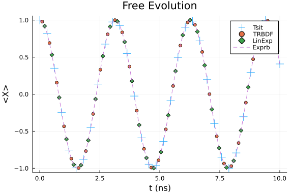
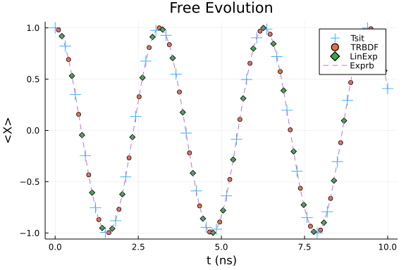
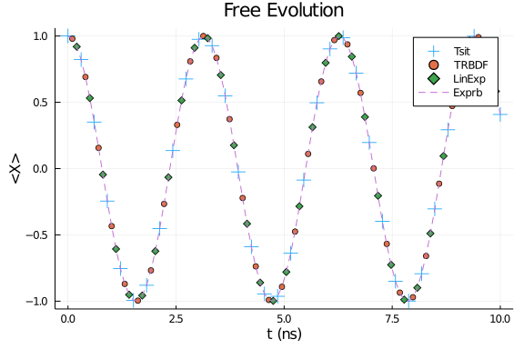

## Closed-system Examples
This notebook will get you started with HOQST by introducing you to the functionality for solving closed-system equations.

### Define the Hamiltonian
The first step is to define a Hamiltonian. In this tutorial, we focus on a 2-level system with the following Hamiltonian:

$$H(s) = - \sigma_z$$

where $s= t/t_f$ is the dimensionless time and $t_f$ is the total evolution time. We use a constant Hamiltonian so that the simulation results can be trivially confirmed. The syntax is the same for time-dependent Hamiltonians. Let's first define the Hamiltonian by:

```julia
using OpenQuantumTools, OrdinaryDiffEq, Plots
# define the Hamiltonian
H = DenseHamiltonian([(s)->1.0], [-σz], unit=:ħ)
```

```
DenseHamiltonian with ComplexF64
with size: (2, 2)
```


In this example, we use the `DenseHamiltonian` [type](https://docs.julialang.org/en/v1/manual/types/#man-types). It means that the underlying data structure of this Hamiltonian type is [Julia array](https://docs.julialang.org/en/v1/manual/arrays/). There exists a different Hamiltonian type named `SparseHamiltonian` that relies on [sparse array](https://docs.julialang.org/en/v1/stdlib/SparseArrays/) as its internal data structure. Sparsity can only provide performance improvement when the system size is large. So, as a rule of thumb, users should only consider using `SparseHamiltonian` when the system size is larger than 10 qubits. 

The closed-system evolution is completely specified by the Hamiltonian and the initial state. We can combine them into a single `Annealing` object by:

```julia
# define the initial state by PauliVec[k][j],
# which is the jth eigenvector of the 
# Pauli matrix σₖ   
u0 = PauliVec[1][1]
# define total evolution time in (ns)
tf = 10
# combine H and u0 into an Annealing object
annealing = Annealing(H, u0)
```

```
Annealing with OpenQuantumBase.DenseHamiltonian{ComplexF64} and u0 Vector{C
omplexF64}
u0 size: (2,)
```


The initial state in the above code block is
$$\lvert \phi(0) \rangle = \lvert + \rangle \ .$$

We will consider three variants of the closed-system equations in this tutorial.

### Schrodinger equation
We start with the Schrodinger equation
\begin{equation}
    \lvert \dot{\phi} \rangle = -i t_f H(s) \lvert \phi \rangle \ .
\end{equation}

To solve this differential equation, we need to choose a proper algorithm. HOQST relies on `OrdinaryDiffEq.jl` as the low-level solver, which supports a large collection of [algorithms](https://docs.sciml.ai/latest/solvers/ode_solve/). We do not guarantee compatibilities to every solver in this list. Users can try specific algorithms if they are interested. We recommend a list of algorithms we tested as follows:

1. The default Tsitouras 5/4 Runge-Kutta method(Tsit5()).

   This is the default method in `OrdinaryDiffEq` and works well in most cases.

2. A second-order A-B-L-S-stable one-step ESDIRK method(TRBDF2()).

   This is the method widely used in large scale classical circuit simulations. Because this is a second-order method, we recommended using a smaller error tolerance than with other higher-order methods.
 
3. A simple linear exponential method(LinearExponential()).

   This method discretizes the Hamiltonian and does the matrix exponential for each interval.
 
4. Adaptive exponential Rosenbrock methods(Exprb32()/Exprb43()).

   This method belongs to the adaptive exponential Runge-Kutta method family.
 
It is important to note that methods 3 and 4 are exponential methods that are supposed to preserve the state vectors' norm. To solve the Schrodinger equation, we use the function `solve_schrodinger`:

```julia
sol_tsit = solve_schrodinger(annealing, tf, alg=Tsit5(), abstol=1e-6, reltol=1e-6);
sol_trbdf = solve_schrodinger(annealing, tf, alg=TRBDF2(), abstol=1e-6, reltol=1e-6);
# LinearExponential is a fixed-stepsize method, the user needs to specify the time steps using the keyword argument `tstops`.
sol_linexp = solve_schrodinger(annealing, tf, alg=LinearExponential(), abstol=1e-6, reltol=1e-6, tstops=range(0,tf,length=100));
# Even though Exprb is an adaptive method, it tends to skip a lot of middle points. So if you want an accurate solution in the middle,
# it is better to manually add more points.
sol_exprb32 = solve_schrodinger(annealing, tf, alg=Exprb32(), tstops=range(0,tf,length=100));
```


In the above code block, the keyword arguments `abstol` and `reltol` are the absolute and relative error tolerances for [stepsize control](https://diffeq.sciml.ai/stable/basics/common_solver_opts/) in adaptive stepsize ODE algorithms. They are usually chosen by trial-and-error in real applications. 

We plot the observable $\langle X \rangle$ during the evolution.
```julia
# this code block shows how to plot the expectation value of X
t_list = range(0,tf,length=100)
tsit = []
trbdf = []
linexp = []
exprb32 = []
for s in t_list
    # sol_tsit(s)'*σx*sol_tsit(s) calculates the 
    # expectation value <ψ(s)|X|ψ(s)>
    push!(tsit, real(sol_tsit(s)'*σx*sol_tsit(s)))
    push!(trbdf, real(sol_trbdf(s)'*σx*sol_trbdf(s)))
    push!(linexp, real(sol_linexp(s)'*σx*sol_linexp(s)))
    push!(exprb32, real(sol_exprb32(s)'*σx*sol_exprb32(s)))
end
scatter(t_list[1:3:end], tsit[1:3:end], label="Tsit", marker=:+, markersize=8)
scatter!(t_list[2:3:end], trbdf[2:3:end], label="TRBDF")
scatter!(t_list[3:3:end], linexp[3:3:end], label="LinExp", marker=:d)
plot!(t_list, exprb32, label="Exprb", linestyle=:dash)
xlabel!("t (ns)")
ylabel!("<X>")
title!("Free Evolution")
```




### Other closed-system equations
The package also contains several other closed-system solvers.
#### Von Neumann equation
The Von Neumann equation is the "Schrodinger" equation for density matrices:

$$\dot{\rho} = -it_f[H(s), \rho] \ .$$

Even though the Von Neumann equation is equivalent to the Schrodinger equation, it is sometimes numerically more stable than the Schrodinger equation. Users are encouraged to try to solve it using different algorithms.

```julia
annealing = Annealing(H, u0)
sol_tsit = solve_von_neumann(annealing, tf, alg=Tsit5(), abstol=1e-6, reltol=1e-6)
```

```
retcode: Success
Interpolation: specialized 4th order "free" interpolation
t: 78-element Vector{Float64}:
  0.0
  0.025416471135423512
  0.07162657822452011
  0.12691325854682373
  0.19490751014915958
  0.2726355853793798
  0.3605271887342242
  0.4567317595330373
  0.5605608773968302
  0.6707028934398573
  ⋮
  8.939120074440943
  9.079043157023303
  9.218966252579099
  9.358889351841592
  9.498812464077522
  9.638735570753408
  9.77865867186925
  9.91858178595853
 10.0
u: 78-element Vector{Matrix{ComplexF64}}:
 [0.4999999999999999 + 0.0im 0.4999999999999999 + 0.0im; 0.4999999999999999
 + 0.0im 0.4999999999999999 + 0.0im]
 [0.4999999999999999 + 0.0im 0.49935414208671036 + 0.025405526573483335im; 
0.49935414208671036 - 0.025405526573483335im 0.4999999999999999 + 0.0im]
 [0.4999999999999999 + 0.0im 0.4948784008324741 + 0.07138184906644161im; 0.
4948784008324741 - 0.07138184906644161im 0.4999999999999999 + 0.0im]
 [0.4999999999999999 + 0.0im 0.48397931745784584 + 0.12555484945742712im; 0
.48397931745784584 - 0.12555484945742712im 0.4999999999999999 + 0.0im]
 [0.4999999999999999 + 0.0im 0.4624896853719465 + 0.19000865966633518im; 0.
4624896853719465 - 0.19000865966633518im 0.4999999999999999 + 0.0im]
 [0.4999999999999999 + 0.0im 0.42749333916749394 + 0.2593249785858282im; 0.
42749333916749394 - 0.2593249785858282im 0.4999999999999999 + 0.0im]
 [0.4999999999999999 + 0.0im 0.3755550340940177 + 0.33008849626629594im; 0.
3755550340940177 - 0.33008849626629594im 0.4999999999999999 + 0.0im]
 [0.4999999999999999 + 0.0im 0.3055038033358539 + 0.3958123598770916im; 0.3
055038033358539 - 0.3958123598770916im 0.4999999999999999 + 0.0im]
 [0.4999999999999999 + 0.0im 0.21733623500020222 + 0.4502943011397252im; 0.
21733623500020222 - 0.4502943011397252im 0.4999999999999999 + 0.0im]
 [0.4999999999999999 + 0.0im 0.1136920270510518 + 0.4869025751944247im; 0.1
136920270510518 - 0.4869025751944247im 0.4999999999999999 + 0.0im]
 ⋮
 [0.4999999999999999 + 0.0im 0.2821073484217871 - 0.41281358782161676im; 0.
2821073484217871 + 0.41281358782161676im 0.4999999999999999 + 0.0im]
 [0.4999999999999999 + 0.0im 0.38515512982679945 - 0.3188340219044511im; 0.
38515512982679945 + 0.3188340219044511im 0.4999999999999999 + 0.0im]
 [0.4999999999999999 + 0.0im 0.45823625142319285 - 0.20004784095116765im; 0
.45823625142319285 + 0.20004784095116765im 0.4999999999999999 + 0.0im]
 [0.4999999999999999 + 0.0im 0.4956646892064485 - 0.06569710719212833im; 0.
4956646892064485 + 0.06569710719212833im 0.4999999999999999 + 0.0im]
 [0.4999999999999999 + 0.0im 0.49452835190039657 + 0.07376514365301369im; 0
.49452835190039657 - 0.07376514365301369im 0.4999999999999999 + 0.0im]
 [0.4999999999999999 + 0.0im 0.45491564944559415 + 0.20748814995777462im; 0
.45491564944559415 - 0.20748814995777462im 0.4999999999999999 + 0.0im]
 [0.4999999999999999 + 0.0im 0.37990862038365286 + 0.3250677065989978im; 0.
37990862038365286 - 0.3250677065989978im 0.4999999999999999 + 0.0im]
 [0.4999999999999999 + 0.0im 0.2753431126702872 + 0.4173556484011125im; 0.2
753431126702872 - 0.4173556484011125im 0.4999999999999999 + 0.0im]
 [0.4999999999999999 + 0.0im 0.20403994993824467 + 0.4564726338136288im; 0.
20403994993824467 - 0.4564726338136288im 0.4999999999999999 + 0.0im]
```


As shown below, the solution given by the solver is the density matrix instead of the state vector:

```julia
sol_tsit(0.5)
```

```
2×2 Matrix{ComplexF64}:
      0.5+0.0im       0.270151+0.420736im
 0.270151-0.420736im       0.5+0.0im
```


##### Recommended algorithm
Only explicit methods are supported for solving equations w.r.t. density matrices. [Vectorization] (https://en.wikipedia.org/wiki/Vectorization_(mathematics)) is needed for implicit methods. This can be done by setting the `vectorize` keyword argument to be true. For example, in the following code block, we solve the Von Neumann equation with the TRBDF2 method:

```julia
sol_bdf = solve_von_neumann(annealing, tf, alg=TRBDF2(), reltol=1e-6, vectorize=true)
sol_bdf(0.5 * tf)
```

```
4-element Vector{ComplexF64}:
   0.4999999999999999 + 0.0im
 -0.42145581736316345 + 0.2689406069997065im
 -0.42145581736316345 - 0.2689406069997065im
   0.4999999999999999 + 0.0im
```


As shown above, the solution given by the solver becomes a vectorized version of the density matrix.

Side note: `TRBDF2` can actually work without vectorizing the Von Neumann equation. However, this is not generally true for other algorithms/solvers. For example, we will run into errors for `LinearExponential` method if no vectorization is performed:

```julia
sol_linexp = solve_von_neumann(annealing, tf, alg=LinearExponential(), tstops=range(0,tf,length=100));
sol_linexp = solve_von_neumann(annealing, tf, alg=LinearExponential(), tstops=range(0,tf,length=100), vectorize=true);
```

```
Error: MethodError: no method matching (Matrix)(::OpenQuantumTools.var"#35#
39")
Closest candidates are:
  (Matrix)(!Matched::Union{LinearAlgebra.QR, LinearAlgebra.QRCompactWY}) at
 d:\Julia-1.7.3\share\julia\stdlib\v1.7\LinearAlgebra\src\qr.jl:441
  (Matrix)(!Matched::IterativeSolvers.BrokenArrowBidiagonal{T}) where T at 
C:\Users\chenh\.julia\packages\IterativeSolvers\rhYBz\src\svdl.jl:53
  (Matrix)(!Matched::ArnoldiMethod.Rotation3{Tc, Ts}, !Matched::Int64) wher
e {Tc, Ts} at C:\Users\chenh\.julia\packages\ArnoldiMethod\JdEiw\src\schurf
act.jl:45
  ...
```


We can again plot the $\langle X \rangle$ for different methods:

```julia
sol_tsit = solve_von_neumann(annealing, tf, alg=Tsit5(), reltol=1e-6);
sol_trbdf = solve_von_neumann(annealing, tf, alg=TRBDF2(), reltol=1e-6);

sol_linexp = solve_von_neumann(annealing, tf, alg=LinearExponential(), tstops=range(0,tf,length=100), vectorize=true);

sol_exprb32 = solve_von_neumann(annealing, tf, alg=Exprb32(), tstops=range(0,tf,length=100), vectorize=true);

t_list = range(0,tf,length=100)
tsit = []
trbdf = []
linexp = []
exprb32 = []
for s in t_list
    push!(tsit, real(tr(sol_tsit(s)*σx)))
    push!(trbdf, real(tr(sol_trbdf(s)*σx)))
    push!(linexp, real(tr(σx*reshape(sol_linexp(s),2,2))))
    push!(exprb32, real(tr(σx*reshape(sol_exprb32(s),2,2))))
end
scatter(t_list[1:3:end], tsit[1:3:end], label="Tsit", marker=:+, markersize=8)
scatter!(t_list[2:3:end], trbdf[2:3:end], label="TRBDF")
scatter!(t_list[3:3:end], linexp[3:3:end], label="LinExp", marker=:d)
plot!(t_list, exprb32, label="Exprb", linestyle=:dash)
xlabel!("t (ns)")
ylabel!("<X>")
title!("Free Evolution")
```




#### Unitary
Lastly, we can also solve the unitary

$$U(s) = T_+ \exp\bigg\{ -i t_f \int_0^s H(s') \mathrm{d}s' \bigg\}$$

using `solve_unitary`. The ODE form of the problem is

$$\dot{U} = -i t_f H(s) U \ .$$

Although this is in principle equivalent to the Schrodinger/Von Neumann equation, the unitary becomes handy in certain cases, e.g., when solving the Redfield equation.

```julia
annealing = Annealing(H, u0)
sol_tsit = solve_unitary(annealing, tf, alg=Tsit5(),abstol=1e-6, reltol=1e-6)
sol_tsit(0.5 * tf)
```

```
2×2 Matrix{ComplexF64}:
 0.283662-0.958924im       0.0+0.0im
      0.0+0.0im       0.283662+0.958924im
```


Again we plot the $\langle X \rangle$ obtained by multiplying the unitary by the initial state.

```julia
sol_tsit = solve_unitary(annealing, tf, alg=Tsit5(), reltol=1e-6);
sol_trbdf = solve_unitary(annealing, tf, alg=TRBDF2(), reltol=1e-6, vectorize=true);
# LinearExponential is a fixed step size method, users need to specify the time steps using the keyword argument `tstops`.
sol_linexp = solve_unitary(annealing, tf, alg=LinearExponential(), tstops=range(0,tf,length=100), vectorize=true);
# Even though Exprb method is an adaptive method, it tends to skip a lot of middle points. So if you want an accurate evolution in the middle,
# it is better to manually add more points for the algorithm.
sol_exprb32 = solve_unitary(annealing, tf, alg=Exprb32(), tstops=range(0,tf,length=100), vectorize=true);

t_list = range(0,tf,length=100)
tsit = []
trbdf = []
linexp = []
exprb32 = []
for s in t_list
    state_tsit = sol_tsit(s) * u0
    state_trbdf = reshape(sol_trbdf(s), 2, 2) * u0
    state_linexp = reshape(sol_linexp(s), 2, 2) * u0
    state_exprb32 = reshape(sol_exprb32(s), 2, 2) * u0
    push!(tsit, real(state_tsit' * σx * state_tsit))
    push!(trbdf, real(state_trbdf' * σx * state_trbdf))
    push!(linexp, real(state_linexp' * σx * state_linexp))
    push!(exprb32, real(state_exprb32' * σx * state_exprb32))
end
scatter(t_list[1:3:end], tsit[1:3:end], label="Tsit", marker=:+, markersize=8)
scatter!(t_list[2:3:end], trbdf[2:3:end], label="TRBDF")
scatter!(t_list[3:3:end], linexp[3:3:end], label="LinExp", marker=:d)
plot!(t_list, exprb32, label="Exprb", linestyle=:dash)
xlabel!("t (ns)")
ylabel!("<X>")
title!("Free Evolution")
```




## Appendix
 This tutorial is part of the HOQSTTutorials.jl repository, found at: <https://github.com/USCqserver/HOQSTTutorials.jl>.

To locally run this tutorial, do the following commands:
```
using HOQSTTutorials
HOQSTTutorials.weave_file("introduction","01-closed_system.jmd")
```

Computer Information:
```
Julia Version 1.7.3
Commit 742b9abb4d (2022-05-06 12:58 UTC)
Platform Info:
  OS: Windows (x86_64-w64-mingw32)
  CPU: Intel(R) Core(TM) i7-6700K CPU @ 4.00GHz
  WORD_SIZE: 64
  LIBM: libopenlibm
  LLVM: libLLVM-12.0.1 (ORCJIT, skylake)

```

Package Information:

```
Status `tutorials\introduction\Project.toml`
[91a5bcdd-55d7-5caf-9e0b-520d859cae80] Plots 1.29.1
[1dea7af3-3e70-54e6-95c3-0bf5283fa5ed] OrdinaryDiffEq 6.15.0
[b964fa9f-0449-5b57-a5c2-d3ea65f4040f] LaTeXStrings 1.3.0
[1fd47b50-473d-5c70-9696-f719f8f3bcdc] QuadGK 2.4.2
[2913bbd2-ae8a-5f71-8c99-4fb6c76f3a91] StatsBase 0.33.16
[e429f160-8886-11e9-20cb-0dbe84e78965] OpenQuantumTools 0.7.0
```
