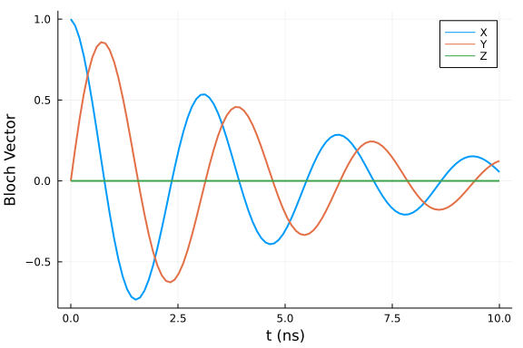
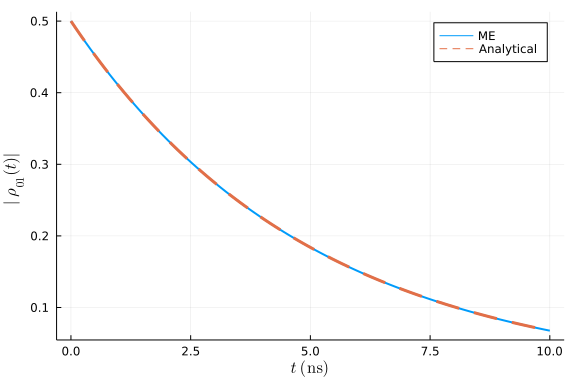
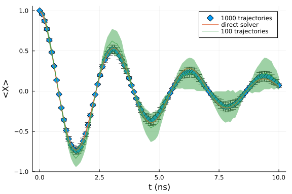
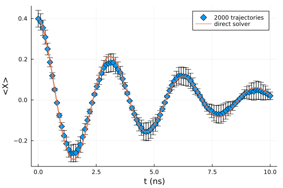

This tutorial demonstrates how to solve the time-independent Lindblad equation using HOQST.

## Model setup
We consider the Lindblad equation of the following form:

$$\dot{\rho} = -i[H, \rho] + \sum_i\gamma_i \Big( L_i \rho L_i^\dagger - \frac{1}{2}\big\{L_i^\dagger L_i, \rho\big\}\Big) \ .$$
In this example, we choose a constant Hamiltonian

$$H(s) = \sigma_z \ ,$$

a single Lindblad operator $L=\sigma_z$ and a single rate $\gamma$. The entire evolution can be defined by:

```julia
using OpenQuantumTools, OrdinaryDiffEq, Plots
# define the Hamiltonian
H = DenseHamiltonian([(s)->1.0], [σz], unit=:ħ)
# define the initial state
u0 = PauliVec[1][1]*PauliVec[1][1]'
# define the Lindblad operator
# the rate and Lindblad operator can also be time-dependent functions
lind = Lindblad(0.1, σz)
# combine them into an Annealing object
annealing = Annealing(H, u0, interactions = InteractionSet(lind))
```

```
Annealing with OpenQuantumBase.DenseHamiltonian{ComplexF64} and u0 Matrix{C
omplexF64}
u0 size: (2, 2)
```


## Dynamics
The solution of the Lindblad ME can be obtained by calling `solve_lindblad`:
```julia
# define total annealing/evolution time
tf = 10
# solve the Lindblad equation
sol = solve_lindblad(annealing, 10, alg=Tsit5());
```


In the following code blocks, we show how to extract useful quantities like the Bloch vector or density matrix elements from the simulation results:
```julia
t_axis = range(0, 10, length=100)
bloch_vector = []
for t in t_axis
    # matrix_decompose projects a matrix onto a list of basis elements
    push!(bloch_vector, 2*real.(matrix_decompose(sol(t), [σx, σy, σz])))
end

off_diag = []
for t in t_axis
    push!(off_diag, abs(sol(t)[1,2]))
end
```


We first plot the Bloch vector representation of the qubit along the evolution:
```julia
plot(t_axis, [c[1] for c in bloch_vector], label="X", linewidth=2)
plot!(t_axis, [c[2] for c in bloch_vector], label="Y", linewidth=2)
plot!(t_axis, [c[3] for c in bloch_vector], label="Z", linewidth=2)
xlabel!("t (ns)")
ylabel!("Bloch Vector")
```




Then, we plot the absolute value of the off-diagonal element $|\rho_{01}|$ and compare it with the analytical solution:
```julia
plot(t_axis, off_diag, linewidth=2, label="ME")
plot!(t_axis, 0.5*exp.(-0.2*t_axis), linestyle=:dash, linewidth=3, label="Analytical")
xlabel!("t (ns)")
ylabel!("|ρ₀₁(t)|")
```




## Quantum trajectories method
In this section, we show how to perform the same simulation using the quantum trajectories method. This is done by:
```julia
# For the quantum trajectories method, the u0 supplied to `Annealing` must be
# a state vector.
# We will show how to replace it with a pure state ensemble later
# in this example
u0 = PauliVec[1][1]
lind = Lindblad(0.1, σz)
annealing = Annealing(H, u0, interactions = InteractionSet(lind))
tf = 10
prob = build_ensembles(annealing, tf, :lindblad)
# We ran each trajectory serially for the sake of simplicity. The user is encouraged to try parallel algorithms.
sol = solve(prob, Tsit5(), EnsembleSerial(), trajectories=1000, saveat=range(0,tf,length=100))
```


We can pick one trajectory from the entire set of trajectories and observe how its norm shrinks during the evolution:
```julia
vec_norm = []
# this is the index of the trajectory you want to look at
idx = 2
for v in sol[idx].u
    push!(vec_norm, norm(v))
end
plot(sol[idx].t, vec_norm, linewidth=2, label="", xlabel="t (ns)", ylabel="‖ψ̃(t)‖")
```


We can also compare the results of the quantum trajectories method with the result of the direct solver:
```julia
t_axis = range(0,tf,length=100)
dataset = []
for t in t_axis
    temp = []
    for so in sol
        v = normalize(so(t))
        push!(temp, real.(v'*σx*v))
    end
    push!(dataset, temp)
end

x_mean = []
x_sem = []
for data in dataset
    t_mean = sum(data)/1000
    t_sem = sqrt(sum((x)->(x-t_mean)^2, data))/1000
    push!(x_mean, t_mean)
    push!(x_sem, t_sem)
end

scatter(t_axis, x_mean, marker=:d, yerror=2 * x_sem, label="1000 trajectories", markersize=6, ylabel="<X>", xlabel="t (ns)")
plot!(t_axis, [c[1] for c in bloch_vector], linewidth=2, label="direct solver")

dataset = []
for t in t_axis
    temp = []
    for so in sol[1:100]
        v = normalize(so(t))
        push!(temp, real.(v'*σx*v))
    end
    push!(dataset, temp)
end

x_mean = []
x_sem = []
for data in dataset
    t_mean = sum(data)/100
    t_sem = sqrt(sum((x)->(x-t_mean)^2, data))/100
    push!(x_mean, t_mean)
    push!(x_sem, t_sem)
end

plot!(t_axis, x_mean, ribbon=2*x_sem, label="100 trajectories", markersize=6, ylabel="<X>", xlabel="t (ns)")
```




We observe better convergence with more trajectories.

## Pure state ensemble
In this last section, we show how to perform the simulation when the initial state is a pure state ensemble. In this case, we need to use the [prob_func](https://diffeq.sciml.ai/stable/features/ensemble/) interface of [DifferentialEquations.jl](https://diffeq.sciml.ai/stable/) to randomly draw an initial state from the pure state ensemble for each trajectory.

```julia
# PuliVec[1][1] is the plus state and PauliVec[1][2] is the minus state
# The first argument is a list of corresponding probabilities of the
# pure states in the second argument. 
E = EᵨEnsemble([0.7, 0.3], [PauliVec[1][1], PauliVec[1][2]])

function prob_func(prob,i,repeat)
  prob.u0 .= sample_state_vector(E)
  prob
end

u0 = PauliVec[1][1]
lind = Lindblad(0.1, σz)
annealing = Annealing(H, u0, interactions = InteractionSet(lind))
tf = 10
prob = build_ensembles(annealing, tf, :lindblad, prob_func=prob_func)
sol = solve(prob, Tsit5(), EnsembleSerial(), trajectories=2000, saveat=range(0,tf,length=100))
```


We can count the number of each of the pure states in the simulation results:
```julia
initial_state_counter = zeros(2)
for so in sol
    if so.prob.u0 == PauliVec[1][1]
        initial_state_counter[1] += 1
    else
        initial_state_counter[2] += 1
    end
end
bar([0,1],initial_state_counter, label="", ylabel="Frequency", xticks=([0, 1], ["|+⟩","|-⟩"]))
```


Finally, we plot the result of the quantum trajectories method together with the result of the direct solver:
```julia
t_axis = range(0,tf,length=100)
dataset = []
for t in t_axis
    temp = []
    for so in sol
        v = normalize(so(t))
        push!(temp, real.(v'*σx*v))
    end
    push!(dataset, temp)
end

x_mean = []
x_sem = []
for data in dataset
    t_mean = sum(data)/2000
    t_sem = sqrt(sum((x)->(x-t_mean)^2, data))/2000
    push!(x_mean, t_mean)
    push!(x_sem, t_sem)
end

# define Hamiltoian
H = DenseHamiltonian([(s)->1.0], [σz], unit=:ħ)
# define initial state
u0 = 0.7*PauliVec[1][1]*PauliVec[1][1]'+0.3*PauliVec[1][2]*PauliVec[1][2]'
# define Lindblad operator
lind = Lindblad(0.1, σz)
# combine them into an Annealing object
annealing = Annealing(H, u0, interactions = InteractionSet(lind))

# define total annealing/evolution time
tf = 10
# solve the Lindblad equation
sol = solve_lindblad(annealing, 10, alg=Tsit5());

t_axis = range(0, 10, length=100)
x_vector = []
for t in t_axis
    push!(x_vector, 2*real.(matrix_decompose(sol(t), [σx])))
end

scatter(t_axis, x_mean, marker=:d, yerror=2*x_sem, label="2000 trajectories", markersize=6, ylabel="<X>", xlabel="t (ns)")

plot!(t_axis, [c[1] for c in x_vector], linewidth=2, label="direct solver")
```




It is important to note that in order to keep the running-time short we included only 2000 trajectories. The result does not necessarily converge to the true solution.


## Appendix
 This tutorial is part of the HOQSTTutorials.jl repository, found at: <https://github.com/USCqserver/HOQSTTutorials.jl>.

To locally run this tutorial, do the following commands:
```
using HOQSTTutorials
HOQSTTutorials.weave_file("introduction","02-lindblad_equation.jmd")
```

Computer Information:
```
Julia Version 1.6.0
Commit f9720dc2eb (2021-03-24 12:55 UTC)
Platform Info:
  OS: Windows (x86_64-w64-mingw32)
  CPU: Intel(R) Core(TM) i7-6700K CPU @ 4.00GHz
  WORD_SIZE: 64
  LIBM: libopenlibm
  LLVM: libLLVM-11.0.1 (ORCJIT, skylake)

```

Package Information:

```
Status `tutorials\introduction\Project.toml`
[2913bbd2-ae8a-5f71-8c99-4fb6c76f3a91] StatsBase 0.33.4
[1dea7af3-3e70-54e6-95c3-0bf5283fa5ed] OrdinaryDiffEq 5.52.2
[e429f160-8886-11e9-20cb-0dbe84e78965] OpenQuantumTools 0.6.2
[91a5bcdd-55d7-5caf-9e0b-520d859cae80] Plots 1.11.2
[b964fa9f-0449-5b57-a5c2-d3ea65f4040f] LaTeXStrings 1.2.1
[1fd47b50-473d-5c70-9696-f719f8f3bcdc] QuadGK 2.4.1
```
