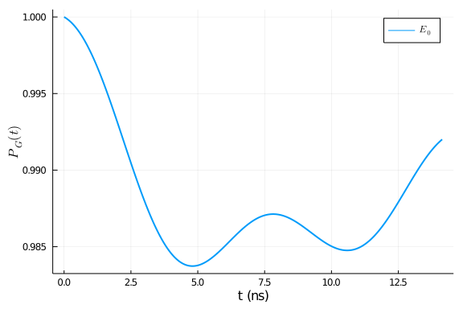
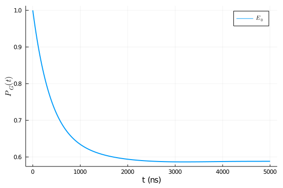

## Single qubit annealing
In this example, we will try to recreate the example in this paper: [Decoherence in adiabatic quantum computation](https://arxiv.org/abs/1503.08767).
The Hamiltonian is

$$H(s) = -\frac{1}{2}(1-s)\sigma_x - \frac{1}{2}s\sigma_z \ .$$

The following code block construct this Hamiltonian

````julia
using QuantumAnnealingTools, OrdinaryDiffEq, Plots
H = DenseHamiltonian([(s)->1-s, (s)->s], -[σx, σz]/2)
````


````
DenseHamiltonian with Complex{Float64}
with size: (2, 2)
````


This package directly interacts with [Plots.jl](https://github.com/JuliaPlots/Plots.jl) by defining [recipes](https://github.com/JuliaPlots/RecipesBase.jl). We can look at the spectrum of the Hamiltonian by directly plotting the object:

````julia
# this plot recipe is for conviniently plotting the spectrum of the Hamltonian
# the first 3 arguments are: the Hamiltonian, the grid `s` and the levels to keep
plot(H, 0:0.01:1, 2, linewidth=2)
````


### Unit ($h$ or $\hbar$)
There is a keyword argument `unit` for the constructor of any Hamiltonian object, whose default value is `:h`. This argument specifies the unit of other input arguments. For example, setting `unit` to `:h` means other input argument is in $\mathrm{GHz}$, while setting it to `:ħ` means the unit is in $2\pi\mathrm{GHz}$. To evaluate the value of Hamiltonian object at a given time, it is recommended to use `evaluate` function instead of directly calling the object. This will also return the value in the unit system of $h=1$.

````julia
H_h = DenseHamiltonian([(s)->1-s, (s)->s], -[σx, σz]/2, unit=:h)
H_ħ = DenseHamiltonian([(s)->1-s, (s)->s], -[σx, σz]/2, unit=:ħ)
println("Setting unit to :h")
````


````
Setting unit to :h
````


````julia
@show evaluate(H_h, 0.5)
````


````
evaluate(H_h, 0.5) = Complex{Float64}[-0.25 + 0.0im -0.25 + 0.0im; -0.25 + 
0.0im 0.25 + 0.0im]
````


````julia
println("Setting unit to :ħ")
````


````
Setting unit to :ħ
````


````julia
@show evaluate(H_ħ, 0.5);
````


````
evaluate(H_ħ, 0.5) = Complex{Float64}[-0.039788735772973836 + 0.0im -0.0397
88735772973836 + 0.0im; -0.039788735772973836 + 0.0im 0.039788735772973836 
+ 0.0im]
2×2 StaticArrays.MArray{Tuple{2,2},Complex{Float64},2,4} with indices SOneT
o(2)×SOneTo(2):
 -0.0397887+0.0im  -0.0397887+0.0im
 -0.0397887+0.0im   0.0397887+0.0im
````


Internally, this package use a unit system of $\hbar=1$. If we call `H_h` directly, we can see that the value is scaled by $2\pi$.

````julia
H_h(0.5)
````


````
2×2 StaticArrays.MArray{Tuple{2,2},Complex{Float64},2,4} with indices SOneT
o(2)×SOneTo(2):
 -1.5708+0.0im  -1.5708+0.0im
 -1.5708+0.0im   1.5708+0.0im
````


### Annealing
The total Hamiltonian is

$$H(s) = H_{\mathrm{S}}(s) + gS \otimes B + H_{\mathrm{B}} \ .$$
We denote $S$ the coupling and $\{gB, H_{\mathrm{B}}\}$ the bath.

#### Coupling
For constant coupling operators, we can use constructor `ConstantCouplings`. Like the case of Hamiltonian, there will be a keyword argument `unit` to specify the input unit.

````julia
coupling = ConstantCouplings(["Z"])
````


````
ConstantCouplings with AbstractArray{T,2} where T
and string representation: ["Z"]
````


#### Bath
A bath instance can be any object which implement three methods:
  1. Correlation function: `correlation(τ, bath)`
  2. Spectrum density: `γ(ω, bath)`
  3. Lamb shift: `S(ω, bath)`

Those three methods are required by Redfield/Adiabatic ME solvers. Currently we have built in support for Ohmic bath.
An Ohmic bath object can be created by :

````julia
η = 1e-4
fc = 4
T = 16
bath = Ohmic(η, fc, T)
````


````
Ohmic bath instance:
η (unitless): 0.0001
ωc (GHz): 4.0
T (mK): 16.0
````


`info_freq` is a convenient function to convert each quantities into the same unit.

````julia
info_freq(bath)
````


````
ωc (GHz): 4.0
T (GHz): 0.33338579560200365
````


We can also directly plot the spectrum density of Ohmic bath

````julia
p1 = plot(bath, :γ, range(0,20,length=200), label="", size=(800, 400), linewidth=2)
p2 = plot(bath, :S, range(0,20,length=200), label="", size=(800, 400), linewidth=2)
plot(p1, p2, layout=(1,2), left_margin=3Plots.Measures.mm)
````


#### Annealing object

Finally, we can assemble the annealing object by
````julia
# Hamiltonian
H = DenseHamiltonian([(s)->1-s, (s)->s], -[σx, σz]/2, unit=:ħ)
# initial state
u0 = PauliVec[1][1]
# coupling
coupling = ConstantCouplings(["Z"], unit=:ħ)
# bath
bath = Ohmic(1e-4, 4, 16)
annealing = Annealing(H, u0; coupling=coupling, bath=bath)
````


````
Annealing with hType QTBase.DenseHamiltonian{Complex{Float64}} and uType Ar
ray{Complex{Float64},1}
u0 with size: (2,)
````


Because we want to compare our results to the [reference paper](https://journals.aps.org/pra/abstract/10.1103/PhysRevA.91.062320), we need to set the unit to $\hbar=1$.

### Closed system
Currently there are several interface to the solvers which might be handy. The first one is the solver for Schrodinger equation.

````julia
tf = 10*sqrt(2)
@time sol = solve_schrodinger(annealing, tf, alg=Tsit5(), retol=1e-4)
````


````
0.004172 seconds (2.51 k allocations: 150.972 KiB)
````


````julia
# a convinient plot recipe to plot the instantaneous population during the evolution
# currently only support Hamiltonian with annealing parameter s = t/tf from 0 to 1.
plot(sol, H, [1], 0:0.01:tf, linewidth=2, xlabel = "t (ns)", ylabel="\$P_G(t)\$")
````


The solution is an `ODESolution` object in `DifferentialEquations.jl` package. More details for the interface can be found [here](http://docs.juliadiffeq.org/latest/basics/solution.html). The value of state vector at a given time can be obtained by directly calling the `ODESolution` object.

````julia
sol(0.5)
````


````
2-element Array{Complex{Float64},1}:
 0.6856253144209079 + 0.1750041214939618im
 0.6861430138705714 + 0.1688172359560306im
````


other interface includes

````julia
# You need to solve the unitary first before trying to solve Redfield equation
@time U = solve_unitary(annealing, tf, alg=Tsit5(), abstol=1e-8, retol=1e-8);
````


````julia
@time solve_von_neumann(annealing, tf, alg=Tsit5(), abstol=1e-8, retol=1e-8);
````


### Open System
#### Time dependent Redfield equation
The time depedent Redfield equation interface needs
  1. Annealing object
  2. Total annealing time
  3. Pre-calculated unitary
  
All the other keyword arguments in [solver options](http://docs.juliadiffeq.org/latest/basics/common_solver_opts.html) are supported.

````julia
tf = 10*sqrt(2)
U = solve_unitary(annealing, tf, alg=Tsit5(), abstol=1e-8, retol=1e-8);
sol = solve_redfield(annealing, tf, U; alg=Tsit5(), abstol=1e-8, retol=1e-8)
plot(sol, H, [1], 0:0.01:tf, linewidth=2, xlabel="t (ns)", ylabel="\$P_G(t)\$")
````


#### Adiabatic master equation
The adiabatic master equation interface needs
  1. Annealing object
  2. Total Annealing time

Besides other keyword arguments supported in `DifferentialEquations`, it is highly recommended to add the `ω_hint` keyword argument. By doing this, the solver will pre-compute the lamb shift $S(\omega)$ within given range to speed up the computation.

````julia
tf = 10*sqrt(2)
@time sol = solve_ame(annealing, tf; alg=Tsit5(), ω_hint=range(-6, 6, length=100), reltol=1e-4)
````


````
0.011151 seconds (193.69 k allocations: 4.293 MiB)
````


````julia
plot(sol, H, [1], 0:0.01:tf, linewidth=2, xlabel="t (ns)", ylabel="\$P_G(t)\$")
````





We can solve for a longer anneal time:

````julia
tf = 5000
@time sol_ame = solve_ame(annealing, tf; alg=Tsit5(), ω_hint=range(-6, 6, length=100), reltol=1e-4)
````


````
0.138635 seconds (1.48 M allocations: 75.956 MiB, 17.49% gc time)
````


````julia
plot(sol_ame, H, [1], 0:1:tf, linewidth=2, xlabel="t (ns)", ylabel="\$P_G(t)\$")
````





The above results agree with Fig 2 of the [reference paper](https://journals.aps.org/pra/abstract/10.1103/PhysRevA.91.062320).

#### Trajectory method for adiabatic master equation
The package also supports the trajectory method for AME. More details of this method can be found in this [paper](https://journals.aps.org/pra/abstract/10.1103/PhysRevA.97.022116). The basic workflow is to create ODE [EnsembleProblem](https://docs.juliadiffeq.org/dev/features/ensemble/) via `build_ensembles` interface. Then, the resulting ensemble problem can be solved by the native [Parallel Ensemble Simulations](https://docs.juliadiffeq.org/dev/features/ensemble/) interface of `DifferentialEquations.jl`. The following code block solves the same $t_f = 5000(ns)$ annealing above with 1000 trajectories.

````julia
tf = 5000
prob = build_ensembles(annealing, tf, :ame, ω_hint=range(-6, 6, length=100))
# to use multi-threads, you need to start Julia kernel with multiple threads
sol = solve(prob, Tsit5(), EnsembleThreads(), trajectories=1000, reltol=1e-4, saveat=range(0,1,length=100))

s_axis = range(0,tf,length=100)
dataset = []
for s in s_axis
    w, v = eigen_decomp(H, s/tf)
    push!(dataset, [abs2(normalize(so(s, continuity=:right))' * v[:, 1]) for so in sol])
end

# the following code average over all the trajectories
pop_mean = []
pop_rmse = []
for data in dataset
    p_mean = sum(data)/1000
    p_rmse = sqrt(sum((x)->(x-p_mean)^2, data))/1000
    push!(pop_mean, p_mean)
    push!(pop_rmse, p_rmse)
end

scatter(s_axis, pop_mean, marker=:d, yerror=pop_rmse, label="Trajectory", markersize=6)
plot!(sol_ame, H, [1], s_axis, linewidth=2, label="Non-trajectory")
xlabel!("t (ns)")
ylabel!("\$P_G(s)\$")
````


