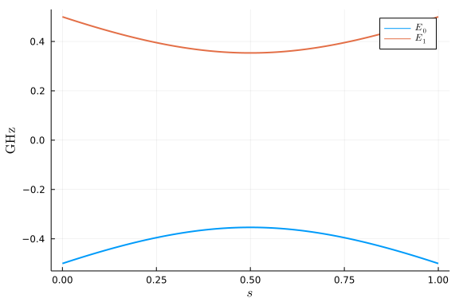
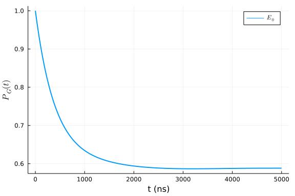
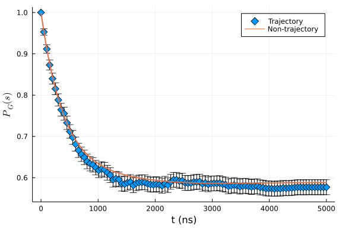

## Single qubit annealing
This tutorial will recreate the single-qubit example in this paper: [[1] Decoherence in adiabatic quantum computation](https://arxiv.org/abs/1503.08767).

The Hamiltonian of this example is

$$H(s) = -\frac{1}{2}(1-s)\sigma_x - \frac{1}{2}s\sigma_z \ ,$$

which can be constructed by the following code block

```julia
using OpenQuantumTools, OrdinaryDiffEq, Plots
H = DenseHamiltonian([(s)->1-s, (s)->s], -[σx, σz]/2)
```

```
DenseHamiltonian with ComplexF64
with size: (2, 2)
```


This package directly interacts with [Plots.jl](https://github.com/JuliaPlots/Plots.jl) by defining [recipes](https://github.com/JuliaPlots/RecipesBase.jl). We can visualize the spectrum of the Hamiltonian by directly plotting the object:

```julia
# this plot recipe is for conveniently plotting the spectrum of the Hamiltonian
# the first 3 arguments are: the Hamiltonian, the grid `s` and the levels to keep
plot(H, 0:0.01:1, 2, linewidth=2)
```




### Units ($h$ or $\hbar$)
A keyword argument `unit` whose default value is `:h` can be provided to any Hamiltonian type's constructor. This argument specifies the units of other input arguments. For example, setting `unit` to `:h` means the other input arguments have units of $\mathrm{GHz}$, while setting it to `:ħ` means the other input arguments have units of $2\pi\mathrm{GHz}$. To evaluate the Hamiltonian at a specified time, the user should use the `evaluate` function instead of directly calling it. `evaluate` will always return the Hamiltonian value in the unit system of $h=1$. The following code block shows the effects of different choices of `unit`:

```julia
H_h = DenseHamiltonian([(s)->1-s, (s)->s], -[σx, σz]/2, unit=:h)
H_ħ = DenseHamiltonian([(s)->1-s, (s)->s], -[σx, σz]/2, unit=:ħ)
println("Setting unit to :h")
@show evaluate(H_h, 0.5)
println("Setting unit to :ħ")
@show evaluate(H_ħ, 0.5);
```

```
Setting unit to :h
evaluate(H_h, 0.5) = ComplexF64[-0.25 + 0.0im -0.25 + 0.0im; -0.25 + 0.0im 
0.25 + 0.0im]
Setting unit to :ħ
evaluate(H_ħ, 0.5) = ComplexF64[-0.039788735772973836 + 0.0im -0.0397887357
72973836 + 0.0im; -0.039788735772973836 + 0.0im 0.039788735772973836 + 0.0i
m]
```


Internally, HOQST uses a unit system of $\hbar=1$. If we call `H_h` directly, its value is scaled by $2\pi$:

```julia
H_h(0.5)
```

```
2×2 StaticArrays.MMatrix{2, 2, ComplexF64, 4} with indices SOneTo(2)×SOneTo
(2):
 -1.5708+0.0im  -1.5708+0.0im
 -1.5708+0.0im   1.5708+0.0im
```


### Annealing
The total Hamiltonian presented in [[1]](https://arxiv.org/abs/1503.08767) is

$$H(s) = H_{\mathrm{S}}(s) + gS \otimes B + H_{\mathrm{B}} \ ,$$

where $S$ denotes the system coupling operator in the system-bath interaction and $\{gB, H_{\mathrm{B}}\}$ are the bath coupling operator and bath Hamiltonian, respectively.

#### Coupling
For constant coupling operators, we can use the constructor `ConstantCouplings`. As in the Hamiltonian case, there is a keyword argument `unit` to specify the input unit.

```julia
coupling = ConstantCouplings(["Z"])
```

```
ConstantCouplings with ComplexF64
and string representation: ["Z"]
```


#### Bath
A bath instance can be any object which implements the following three methods:
  1. Correlation function: `correlation(τ, bath)`
  2. Spectral density: `γ(ω, bath)`
  3. Lamb shift: `S(ω, bath)`

The Redfield/Adiabatic ME solvers require these three methods. Currently, HOQST has built-in support for the Ohmic bath. An Ohmic bath object can be created by:

```julia
η = 1e-4
fc = 4
T = 16
bath = Ohmic(η, fc, T)
```

```
Ohmic bath instance:
η (unitless): 0.0001
ωc (GHz): 4.0
T (mK): 16.0
```


`info_freq` is a convenient function to convert each quantity into the same system of units.

```julia
info_freq(bath)
```

```
ωc (GHz): 4.0
T (GHz): 0.33338579560200365
```


We can also directly plot the spectral density of an Ohmic bath:

```julia
p1 = plot(bath, :γ, range(0,20,length=200), label="", size=(800, 400), linewidth=2)
p2 = plot(bath, :S, range(0,20,length=200), label="", size=(800, 400), linewidth=2)
plot(p1, p2, layout=(1,2), left_margin=3Plots.Measures.mm)
```


#### Annealing object

Finally, we can assemble the annealing object by
```julia
# Hamiltonian
H = DenseHamiltonian([(s)->1-s, (s)->s], -[σx, σz]/2, unit=:ħ)
# initial state
u0 = PauliVec[1][1]
# coupling
coupling = ConstantCouplings(["Z"], unit=:ħ)
# bath
bath = Ohmic(1e-4, 4, 16)
annealing = Annealing(H, u0; coupling=coupling, bath=bath)
```

```
Annealing with OpenQuantumBase.DenseHamiltonian{ComplexF64} and u0 Vector{C
omplexF64}
u0 size: (2,)
```


In order to compare our results to [[1]](https://journals.aps.org/pra/abstract/10.1103/PhysRevA.91.062320) we need to set the units to $\hbar=1$.

### Closed system
There are several interfaces in HOQST that can come in handy. The first one is the Schrodinger equation solver:

```julia
tf = 10*sqrt(2)
@time sol = solve_schrodinger(annealing, tf, alg=Tsit5(), retol=1e-4)
# The following line of code is a convenient recipe to plot the instantaneous population during the evolution.
# It currently only supports Hamiltonians with an annealing parameter s = t/tf from 0 to 1.
# The third argument can be either a list or a number. When it is a list, it specifies the energy levels to plot (starting from 0); when it is a number, it specifies the total number of levels to plot.
plot(sol, H, [0], 0:0.01:tf, linewidth=2, xlabel = "t (ns)", ylabel="\$P_G(t)\$")
```

```
0.005308 seconds (2.63 k allocations: 174.095 KiB, 95.05% compilation tim
e)
```


The solution is an `ODESolution` object in the `DifferentialEquations.jl` package. More details for the interface can be found [here](http://docs.juliadiffeq.org/latest/basics/solution.html). The state vector's value at a given time can be obtained by directly calling the `ODESolution` object.

```julia
sol(0.5)
```

```
2-element Vector{ComplexF64}:
  0.685625314420908 + 0.17500412149396175im
 0.6861430138705717 + 0.16881723595603054im
```


Other interfaces include:

```julia
# You need to solve the unitary first before trying to solve Redfield equation
@time U = solve_unitary(annealing, tf, alg=Tsit5(), abstol=1e-8, retol=1e-8);
@time solve_von_neumann(annealing, tf, alg=Tsit5(), abstol=1e-8, retol=1e-8);
```


### Open System
#### Time-dependent Redfield equation
The time-dependent Redfield equation solver needs
  1. Annealing object
  2. Total annealing time
  3. Pre-calculated unitary
to work. The following code block illustrates how to supply the above three objects to the Redfield solver. In addition all the other keyword arguments in [DifferentialEquations.jl](https://diffeq.sciml.ai/stable/basics/common_solver_opts/) are supported.

```julia
tf = 10*sqrt(2)
U = solve_unitary(annealing, tf, alg=Tsit5(), abstol=1e-8, retol=1e-8);
sol = solve_redfield(annealing, tf, U; alg=Tsit5(), abstol=1e-8, retol=1e-8)
plot(sol, H, [0], 0:0.01:tf, linewidth=2, xlabel="t (ns)", ylabel="\$P_G(t)\$")
```


#### Adiabatic master equation
The adiabatic master equation solver needs
  1. Annealing object
  2. Total Annealing time

Besides other keyword arguments supported in [DifferentialEquations.jl](https://diffeq.sciml.ai/stable/basics/common_solver_opts/), we recommend adding the `ω_hint` keyword argument. By doing this, the solver will pre-compute the quantity $S(\omega)$ in the Lamb shift within the range specified by `ω_hint`, which will significantly speed up the computation.

```julia
tf = 10*sqrt(2)
@time sol = solve_ame(annealing, tf; alg=Tsit5(), ω_hint=range(-6, 6, length=100), reltol=1e-4)
plot(sol, H, [0], 0:0.01:tf, linewidth=2, xlabel="t (ns)", ylabel="\$P_G(t)\$")
```

```
0.007874 seconds (56.35 k allocations: 1.650 MiB)
```


We can also solve the AME for a longer annealing time:

```julia
tf = 5000
@time sol_ame = solve_ame(annealing, tf; alg=Tsit5(), ω_hint=range(-6, 6, length=100), reltol=1e-6)
plot(sol_ame, H, [0], 0:1:tf, linewidth=2, xlabel="t (ns)", ylabel="\$P_G(t)\$")
```

```
0.133935 seconds (1.24 M allocations: 67.898 MiB, 20.39% gc time)
```





The above results agree with Fig. 2 of [[1]](https://journals.aps.org/pra/abstract/10.1103/PhysRevA.91.062320).

#### Quantum trajectories method for the adiabatic master equation
The package also supports the quantum trajectories method for the AME. More details of this method can be found in [[2] Quantum trajectories for time-dependent adiabatic master equations](https://journals.aps.org/pra/abstract/10.1103/PhysRevA.97.022116). The basic workflow is to create an ODE [EnsembleProblem](https://docs.juliadiffeq.org/dev/features/ensemble/) via the `build_ensembles` interface. The resulting `EnsembleProblem` object can then be solved by the native [Parallel Ensemble Simulations](https://docs.juliadiffeq.org/dev/features/ensemble/) interface of `DifferentialEquations.jl`. The following code block solves the same annealing dynamics described above ($t_f = 5000(ns)$) using multi-threading. To keep the run-time reasonably short, we simulate only 3000 trajectories in this example. This may be too small for the result to converge to the true solution. The user is encouraged to try more trajectories and see how the result converges.

The codes can also be deployed on high-performance clusters using Julia's native [distributed computing](https://docs.julialang.org/en/v1/manual/distributed-computing/) module.

```julia
tf = 5000
# total number of trajectories
num_trajectories = 3000
# construct the `EnsembleProblem` 
# `safetycopy` needs to be true because the current trajectories implementation is not thread-safe.
prob = build_ensembles(annealing, tf, :ame, ω_hint=range(-6, 6, length=200), safetycopy=true)
# to use multi-threads, you need to start the Julia kernel with multiple threads
# julia --threads 8
sol = solve(prob, Tsit5(), EnsembleThreads(), trajectories=num_trajectories, reltol=1e-6, saveat=range(0,tf,length=100))

t_axis = range(0,tf,length=100)
dataset = []
for t in t_axis
    w, v = eigen_decomp(H, t/tf)
    push!(dataset, [abs2(normalize(so(t))' * v[:, 1]) for so in sol])
end

# the following codes calculate the instantaneous ground state population and the corresponding error bars by averaging over all the trajectories:

pop_mean = []
pop_sem = []
for data in dataset
    p_mean = sum(data) / num_trajectories
    p_sem = sqrt(sum((x)->(x-p_mean)^2, data)) / num_trajectories
    push!(pop_mean, p_mean)
    push!(pop_sem, p_sem)
end

scatter(t_axis, pop_mean, marker=:d, yerror=2*pop_sem, label="Trajectory", markersize=6)
plot!(sol_ame, H, [0], t_axis, linewidth=2, label="Non-trajectory")
xlabel!("t (ns)")
ylabel!("\$P_G(s)\$")
```




## Appendix
 This tutorial is part of the HOQSTTutorials.jl repository, found at: <https://github.com/USCqserver/HOQSTTutorials.jl>.

To locally run this tutorial, do the following commands:
```
using HOQSTTutorials
HOQSTTutorials.weave_file("introduction","03-single_qubit_ame.jmd")
```

Computer Information:
```
Julia Version 1.6.0
Commit f9720dc2eb (2021-03-24 12:55 UTC)
Platform Info:
  OS: Windows (x86_64-w64-mingw32)
  CPU: Intel(R) Core(TM) i7-6700K CPU @ 4.00GHz
  WORD_SIZE: 64
  LIBM: libopenlibm
  LLVM: libLLVM-11.0.1 (ORCJIT, skylake)

```

Package Information:

```
Status `tutorials\introduction\Project.toml`
[2913bbd2-ae8a-5f71-8c99-4fb6c76f3a91] StatsBase 0.33.4
[1dea7af3-3e70-54e6-95c3-0bf5283fa5ed] OrdinaryDiffEq 5.52.2
[e429f160-8886-11e9-20cb-0dbe84e78965] OpenQuantumTools 0.6.2
[91a5bcdd-55d7-5caf-9e0b-520d859cae80] Plots 1.11.2
[b964fa9f-0449-5b57-a5c2-d3ea65f4040f] LaTeXStrings 1.2.1
[1fd47b50-473d-5c70-9696-f719f8f3bcdc] QuadGK 2.4.1
```
