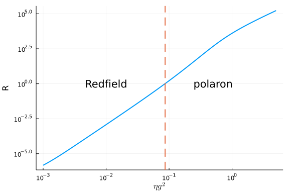
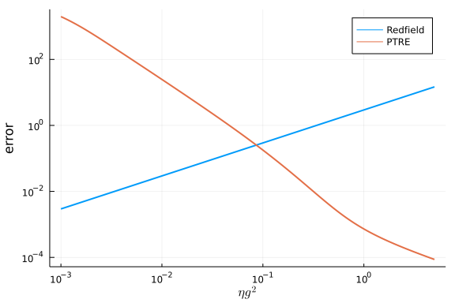
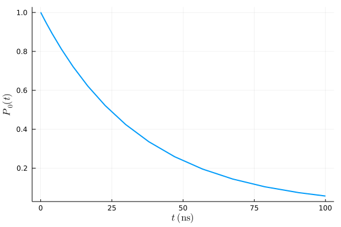
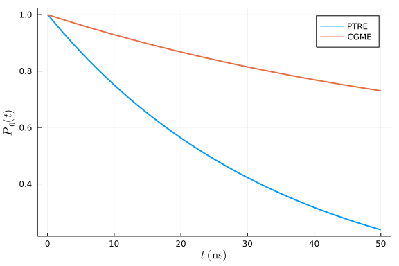
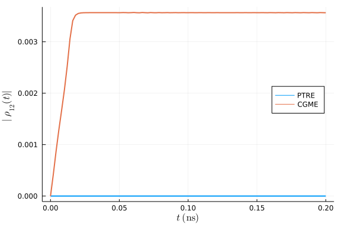

## Correlation function in the polaron frame
This tutorial demonstrates how to use the polaron transformed Redfield equation (PTRE) in HOQST. For more details on the PTRE, see [[1] Non-canonical distribution and non-equilibrium transport beyond weak system-bath coupling regime: A polaron transformation approach](https://link.springer.com/article/10.1007%2Fs11467-016-0540-2).

We solve both the Redfield equation and the PTRE for a single qubit Hamiltonian

$$H_\mathrm{S}=\epsilon \sigma_z + \Delta \sigma_x$$

coupled to an Ohmic bath via $\sigma_z$ interaction:

$$H = H_\mathrm{S} + \sigma_z \otimes B + H_\mathrm{B}\ .$$

Loosely, the main difference between the Redfield equation and PTRE is that they have different bath correlation functions. For the Redfield equation, the bath correlation function is

$$C(t_1, t_2) = \langle B(t_1)B(t_2) \rangle \ .$$

In the polaron frame, however, the bath correlation function becomes

$$K(t_1, t_2) = \exp\Big\{ -4 \int_0^t \int_{-\infty}^{0}C(t_1, t_2) \mathrm{d}t_1 \mathrm{d}t_2 \Big\} \ .$$

Interested readers can refer to [[2] Macroscopic Resonant Tunneling in the Presence of Low Frequency Noise](https://link.aps.org/doi/10.1103/PhysRevLett.100.197001) and [[3] Dynamics of the dissipative two-state system](https://link.aps.org/doi/10.1103/RevModPhys.59.1) for more details.

### Error bound on the second-order master equation

The most straightforward analysis is to compare the error bounds given in [[4] Completely positive master equation for arbitrary driving and small level spacing](https://quantum-journal.org/papers/q-2020-02-06-227/) between the Redfield equation and PTRE. We define the error scaling parameter as

$$error = \frac{\tau_\mathrm{B}}{\tau_\mathrm{SB}} \ .$$

Then we plot the error ratio between the Redfield equation and the PTRE

$$R = \frac{error_{\mathrm{Redfield}}}{error_{\mathrm{PTRE}}} \ ,$$

vs. the system bath coupling strength $\eta g^2$ while fixing other parameters in the Ohmic bath.
```julia
using OrdinaryDiffEq, OpenQuantumTools, Plots
using LaTeXStrings

function err_bound(tf, cfun)
    tsb, esb = τ_SB(cfun)
    tb, eb = τ_B(cfun, tf, tsb)
    tb / tsb
end

fc = 4; T =12; tf = 1000;
ηlist = log_uniform(1e-3, 5, 1000)
err_ratio = []
err_clist = []
err_klist = []
for η in ηlist
    bath = Ohmic(η, fc, T)
    cfun = (x)->correlation(x, bath)
    pfun = (x)->polaron_correlation(x, bath)
    err_c = err_bound(tf, cfun)
    err_k = err_bound(tf, pfun)
    push!(err_clist, err_c)
    push!(err_klist, err_k)
    push!(err_ratio, err_c/err_k)
end
idx = findfirst((x)->x>=1, err_ratio)
plot(ηlist, err_ratio, xscale=:log10, yscale=:log10, label="", linewidth=2)
vline!([ηlist[idx]], label="", linestyle=:dash, linewidth=2)
annotate!([(0.5, 1.0, Plots.text("polaron")), (0.01, 1.0, Plots.text("Redfield"))])
xlabel!(L"\eta g^2")
ylabel!("R")
```




From the above figure we observe that when the system-bath coupling strength is larger than $10^{-1}$, the PTRE should have better error scaling than the standard form of the Redfield equation. We also plot the corresponding error values for both the Redfield equation and the PTRE:

```julia
plot(ηlist, err_clist, xscale=:log10, yscale=:log10, label="Redfield", linewidth=2)
plot!(ηlist, err_klist, xscale=:log10, yscale=:log10, label="PTRE", linewidth=2)
xlabel!(L"\eta g^2")
ylabel!("error")
```




The above figure confirms that the Redfield equation applies to the weak-coupling regime while the PTRE applies to the strong coupling regime.

### Solving PTRE

Since the Redfield equation and the PTRE have identical forms, `solve_redfield` can also be used for the PTRE. To see this, let's first write down the PTRE for our example.

$$\dot{\rho}_\mathrm{S} = \epsilon σ_z + [ \sigma_i, \Lambda_i(t) \rho_\mathrm{S}(t) ] + h.c.$$

where $i,j \in [+, -]$, $i \neq j$ and

$$\Lambda_i(t)=\Delta^2 \int_0^{t} K(t-\tau)U(t,\tau) \sigma_j U^\dagger(t,\tau) \mathrm{d}\tau \ .$$

From the above equations, it is clear that the following steps are needed to define an evolution in the polaron frame:
1. define a new Hamiltonian $H = \epsilon σ_z$;
2. define new coupling operators $\sigma_-$ and $\sigma_+$;
3. define a new correlated bath with two-point correlation $K_{i,j}(t_1, t_2)$;

The following code block illustrates how this can be done in HOQST:

```julia
# assume ϵ = 1
const Δ = 0.1 
# define the Ohmic bath in the polaron transformed frame
η = 0.5; bath = Ohmic(η, fc, T)
K(t1, t2) = Δ^2 * polaron_correlation(t1-t2, bath)
cfun = [nothing K; K nothing]
pbath = CorrelatedBath(((1,2),(2,1)), correlation=cfun)
# define coupling as σ+ and σ- operators
σp = [0 1;0 0.0im]; σm = [0 0;1 0.0im]
coupling = ConstantCouplings([σp, σm])
# manually define the unitary operator
U(t) = exp(-2.0im * π * σz * t)
H = DenseHamiltonian([(s)->1.0], [σz])
u0 = PauliVec[3][1]
annealing = Annealing(H, u0, coupling = coupling, bath = pbath)
tf = 100
sol_ptre = solve_redfield(annealing, tf, U, alg=Tsit5(), Ta=2, reltol=1e-5)
pop_e = [real(s[1,1]) for s in sol_ptre.u]
plot(sol_ptre.t, pop_e, xlabel=L"t\ (\mathrm{ns})", ylabel=L"P_0(t)", label="", linewidth = 2)
```




For historical reasons, this is known as an example of "incoherent tunneling". The off-diagonal elements of the density matrix in the computational basis (the Z-basis) vanish during the entire evolution (shown in the next section).

### Redfield equation

What happens to the Redfield equation in this regime? We can also try:

```julia
H = DenseHamiltonian([(s)->1.0], [σz+0.1*σx])
coupling = ConstantCouplings(["Z"])
annealing = Annealing(H, u0, coupling = coupling, bath = bath)
tf = 100
# manually define the unitary operator
U(t) = exp(-2.0im * π * (σz+0.1*σx) * t)
sol_redfield = solve_redfield(annealing, tf, U, alg=Tsit5(), Ta=40, reltol=1e-5, callback=PositivityCheckCallback())
```

```
retcode: Terminated
Interpolation: specialized 4th order "free" interpolation
t: 22-element Vector{Float64}:
 0.0
 0.003928759496976375
 0.005712702105779054
 0.00868538284690315
 0.010748436797295107
 0.013343972909612483
 0.015630574875531853
 0.018040070229891184
 0.020327710050893358
 0.022614512268462634
 ⋮
 0.03126733644196358
 0.03336262989102297
 0.03544603050483967
 0.03752137951197164
 0.03959565980312375
 0.04167340886800694
 0.04375982866539185
 0.04585917830352944
 0.04797576487851534
u: 22-element Vector{Matrix{ComplexF64}}:
 [1.0 + 0.0im 0.0 + 0.0im; 0.0 + 0.0im 0.0 + 0.0im]
 [0.9999942655705363 + 0.0im 2.3405168745021195e-5 + 0.00219374300574346im;
 2.3405168745021195e-5 - 0.00219374300574346im 5.734429463642047e-6 + 0.0im
]
 [0.9999885526527795 + 0.0im -1.6098894434093695e-5 + 0.0028681886770785987
im; -1.6098894434093695e-5 - 0.0028681886770785987im 1.1447347220274872e-5 
+ 0.0im]
 [0.9999762824915798 + 0.0im -0.00026798716109694765 + 0.003654533478940986
im; -0.00026798716109694765 - 0.003654533478940986im 2.3717508419724734e-5 
+ 0.0im]
 [0.9999662031906074 + 0.0im -0.0005842937299489406 + 0.004120304221198509i
m; -0.0005842937299489406 - 0.004120304221198509im 3.379680939219504e-5 + 0
.0im]
 [0.9999517825461793 + 0.0im -0.001115605899581189 + 0.004729454751473413im
; -0.001115605899581189 - 0.004729454751473413im 4.82174538193727e-5 + 0.0i
m]
 [0.9999373816728743 + 0.0im -0.0016835737348890997 + 0.005297796662131235i
m; -0.0016835737348890997 - 0.005297796662131235im 6.261832712481899e-5 + 0
.0im]
 [0.9999204146273409 + 0.0im -0.0023717853091745696 + 0.005910253580108264i
m; -0.0023717853091745696 - 0.005910253580108264im 7.958537265799662e-5 + 0
.0im]
 [0.9999025905694068 + 0.0im -0.003105230981241366 + 0.006488770467415236im
; -0.003105230981241366 - 0.006488770467415236im 9.740943059240977e-5 + 0.0
im]
 [0.999883126735672 + 0.0im -0.003913250858523132 + 0.007054790877644963im;
 -0.003913250858523132 - 0.007054790877644963im 0.00011687326432621205 + 0.
0im]
 ⋮
 [0.9997954625649402 + 0.0im -0.007593216989156528 + 0.009016925074664294im
; -0.007593216989156528 - 0.009016925074664294im 0.000204537435058375 + 0.0
im]
 [0.9997711556620502 + 0.0im -0.008619684963591303 + 0.009442538470109785im
; -0.008619684963591303 - 0.009442538470109785im 0.00022884433794879795 + 0
.0im]
 [0.9997459018236546 + 0.0im -0.009687884470117376 + 0.009845730915410916im
; -0.009687884470117376 - 0.009845730915410916im 0.00025409817634431124 + 0
.0im]
 [0.9997197219479761 + 0.0im -0.010796892837049153 + 0.010227599257367563im
; -0.010796892837049153 - 0.010227599257367563im 0.0002802780520233289 + 0.
0im]
 [0.9996925858837132 + 0.0im -0.011948024515996868 + 0.010589794153091936im
; -0.011948024515996868 - 0.010589794153091936im 0.0003074141162859749 + 0.
0im]
 [0.9996644830460419 + 0.0im -0.01314181747724239 + 0.010933448746627866im;
 -0.01314181747724239 - 0.010933448746627866im 0.0003355169539566007 + 0.0i
m]
 [0.9996353847581846 + 0.0im -0.014379622631485891 + 0.011259742442199539im
; -0.014379622631485891 - 0.011259742442199539im 0.0003646152418134799 + 0.
0im]
 [0.999605267069751 + 0.0im -0.015662623261621465 + 0.011569632687661376im;
 -0.015662623261621465 - 0.011569632687661376im 0.0003947329302471738 + 0.0
im]
 [0.9995740985607838 + 0.0im -0.016992346716545714 + 0.011864024725645031im
; -0.016992346716545714 - 0.011864024725645031im 0.0004259014392143201 + 0.
0im]
```


The Redfield equation becomes non-positive in a very short evolution time. To fix this issue, we use the [coarse-grained master equation (CGME)](https://uscqserver.github.io/HOQSTTutorials.jl/html/introduction/05-CGME_ULE.html) instead.

```julia
tf = 50
solc = solve_cgme(annealing, tf, U, alg=Tsit5(), reltol=1e-3, int_atol=1e-3, int_rtol=1e-3)
t_axis = range(0,50,length=200)
pop_e = [real(sol_ptre(t)[1,1]) for t in t_axis]
pop_e_cg = [real(solc(t)[1,1]) for t in t_axis]
plot(t_axis, pop_e, xlabel=L"t\ (\mathrm{ns})", ylabel=L"P_0(t)", label="PTRE", linewidth = 2)
plot!(t_axis, pop_e_cg, xlabel=L"t\ (\mathrm{ns})", ylabel=L"P_0(t)", label="CGME", linewidth = 2)
```




The PTRE gives a much stronger decay than the Redfield equation for the parameters chosen in this example. One can also verify the amplitude of the off-diagonal elements during the evolution. Unlike the PTRE, the solution of the CGME has non-vanishing off-diagonal elements of the density matrix.

```julia
t_axis = range(0, 0.2, length=100)
off_diag_ptre = [abs(sol_ptre(t)[1,2]) for t in t_axis]
off_diag_cg = [abs(solc(t)[1,2]) for t in t_axis]
plot(t_axis, off_diag_ptre, xlabel=L"t\ (\mathrm{ns})", ylabel=L"\lvert \rho_{12} \rvert|(t)", label="PTRE", linewidth = 2, legend=:right)
plot!(t_axis, off_diag_cg, xlabel=L"t\ (\mathrm{ns})", ylabel=L"|\rho_{12}(t)|", label="CGME", linewidth = 2)
```




## Appendix
 This tutorial is part of the HOQSTTutorials.jl repository, found at: <https://github.com/USCqserver/HOQSTTutorials.jl>.

To locally run this tutorial, do the following commands:
```
using HOQSTTutorials
HOQSTTutorials.weave_file("introduction","04-polaron_transformed_redfield.jmd")
```

Computer Information:
```
Julia Version 1.6.0
Commit f9720dc2eb (2021-03-24 12:55 UTC)
Platform Info:
  OS: Windows (x86_64-w64-mingw32)
  CPU: Intel(R) Core(TM) i7-6700K CPU @ 4.00GHz
  WORD_SIZE: 64
  LIBM: libopenlibm
  LLVM: libLLVM-11.0.1 (ORCJIT, skylake)

```

Package Information:

```
Status `tutorials\introduction\Project.toml`
[2913bbd2-ae8a-5f71-8c99-4fb6c76f3a91] StatsBase 0.33.4
[1dea7af3-3e70-54e6-95c3-0bf5283fa5ed] OrdinaryDiffEq 5.52.2
[e429f160-8886-11e9-20cb-0dbe84e78965] OpenQuantumTools 0.6.2
[91a5bcdd-55d7-5caf-9e0b-520d859cae80] Plots 1.11.2
[b964fa9f-0449-5b57-a5c2-d3ea65f4040f] LaTeXStrings 1.2.1
[1fd47b50-473d-5c70-9696-f719f8f3bcdc] QuadGK 2.4.1
```
