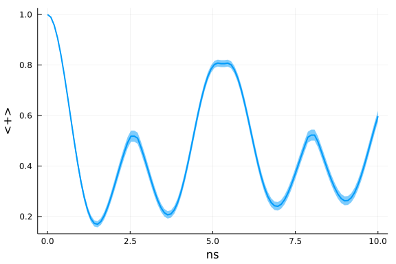

## Spin-fluctuator model (Classical 1/f noise)
The spin-fluctuator model is a way to model 1/f noise in solid-state systems and is discussed in more detail in Dr. Yip's [thesis](https://github.com/USCqserver/1fnoise/blob/master/Kawa_Yip_thesis.pdf). You can also find Dr. Yip's MATLAB implementation in this [1fnoise](https://github.com/USCqserver/1fnoise) repo.

The total Hamiltonian in this tutorial is

$$H(s) = -Z+ \frac{1}{2}\sum_i n_i(s) Z \ ,$$

where $n_i(s)$ is the telegraph process that switches randomly between $\pm b_i$ with a rate $\gamma_i$. The summation $\sum_i n_i(s)$ generates the "1/f" noise approximately.

We choose the initial state to be:

$$\lvert \phi(0) \rangle = \lvert + \rangle \ .$$

### EnsembleFluctuator

We first construct the fluctuator bath object using `EnsembleFluctuator` and plot its spectral density:


```julia
using OpenQuantumTools, LaTeXStrings
using OrdinaryDiffEq, Plots, StatsBase

# calculate the mean and standard deviation of the mean estimator from a sample
function mean_std(sample)
    m, v = mean_and_std(sample, corrected=true)
    m, v/sqrt(length(sample))
end

# All values calculated below are in angular frequency units
num = 10
bvec = 0.2 * ones(num)
γvec = log_uniform(0.01, 1, num)
fluctuator_ensemble = EnsembleFluctuator(bvec, γvec);

plot(fluctuator_ensemble, :spectrum, 2*π*range(0.01, 4, length=100), xscale=:log10, yscale=:log10, linewidth=2, label="")
xlabel!(L"\omega")
ylabel!(L"S(\omega)")
```


### Free Evolution

We then calculate the dynamics of the free evolution:

```julia
H = DenseHamiltonian([(s)->1], [σz], unit=:ħ)
coupling = ConstantCouplings([0.5*σz], unit=:ħ)
u0 = PauliVec[1][1]
annealing = Annealing(H, u0, coupling = coupling, bath=fluctuator_ensemble)
tf = 10
# create object for parallel simulation
prob = build_ensembles(annealing, tf, :stochastic)
# we run each trajectory serially for this example
sol = solve(prob, Tsit5(), EnsembleSerial(), trajectories=1000, reltol=1e-6, saveat=range(0,tf,length=100))
```


After the solution is obtained, we plot $\langle + \rangle$ during the evolution:

```julia
t_axis = range(0,tf,length=100)
es = []
err = []
for (i, s) in enumerate(t_axis)
    sample = [abs2(u0'*so[i]) for so in sol]
    pop, pop_std = mean_std(sample)
    push!(es, pop)
    push!(err, 2*pop_std)
end

plot(t_axis, es, ribbon=err, linewidth=2, label="")
xlabel!("ns")
ylabel!("<+>")
```


### Pulses in the middle
We can also apply instantaneous pulses during the middle of the evolution using `InstPulseControl`. In the following example, we apply $X$ pulses at $s = 0.25, 0.5$ and $0.75$.

```julia
cb = InstPulseCallback([0.25, 0.5, 0.75] .* tf, (c, x) -> c .= σx * c)
sol = solve(prob, Tsit5(), EnsembleSerial(), trajectories=1000, reltol=1e-6, saveat=range(0,tf,length=100), callback=cb)
```


We again plot $\langle + \rangle$ w.r.t the evolution time:

```julia
s_axis = range(0,1,length=100)
es = []
err = []
for (i, s) in enumerate(s_axis)
    sample = [abs2(u0'*so[i]) for so in sol]
    pop, pop_std = mean_std(sample)
    push!(es, pop)
    push!(err, 2*pop_std)
end

plot(tf*s_axis, es, ribbon=err, linewidth=2, label="")
xlabel!("ns")
ylabel!("<+>")
```




## Appendix
 This tutorial is part of the HOQSTTutorials.jl repository, found at: <https://github.com/USCqserver/HOQSTTutorials.jl>.

To locally run this tutorial, do the following commands:
```
using HOQSTTutorials
HOQSTTutorials.weave_file("introduction","06-spin_fluctuators.jmd")
```

Computer Information:
```
Julia Version 1.6.1
Commit 6aaedecc44 (2021-04-23 05:59 UTC)
Platform Info:
  OS: Windows (x86_64-w64-mingw32)
  CPU: Intel(R) Core(TM) i7-6700K CPU @ 4.00GHz
  WORD_SIZE: 64
  LIBM: libopenlibm
  LLVM: libLLVM-11.0.1 (ORCJIT, skylake)

```

Package Information:

```
Status `tutorials\introduction\Project.toml`
[e429f160-8886-11e9-20cb-0dbe84e78965] OpenQuantumTools 0.6.2
[2913bbd2-ae8a-5f71-8c99-4fb6c76f3a91] StatsBase 0.33.4
[1fd47b50-473d-5c70-9696-f719f8f3bcdc] QuadGK 2.4.1
[b964fa9f-0449-5b57-a5c2-d3ea65f4040f] LaTeXStrings 1.2.1
[1dea7af3-3e70-54e6-95c3-0bf5283fa5ed] OrdinaryDiffEq 5.52.2
[91a5bcdd-55d7-5caf-9e0b-520d859cae80] Plots 1.11.2
```
