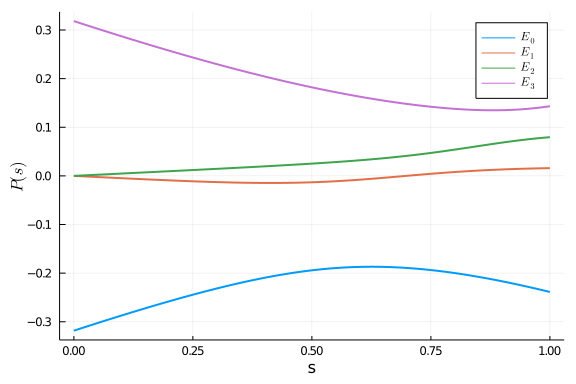
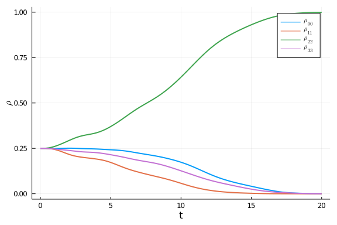

In this notebook, we will construct an example where the Redfield equation becomes non-positive. We will also show how to use the positivity-check routine to stop the solver when this happens.

## Ohmic bath
We first create an Ohmic bath with the following parameters:

```julia
using OpenQuantumTools, OrdinaryDiffEq, Plots, Printf, LaTeXStrings

β = 4
T = β_2_temperature(β)
η = 0.1
fc= 10/(2π)
bath = Ohmic(η, fc, T)
```

```
Ohmic bath instance:
η (unitless): 0.1
ωc (GHz): 1.5915494309189535
T (mK): 1.9095587777458247
```


The spectral density $\gamma$ is plotted below:

```julia
plot(bath, :γ, range(0,10,length=100), linewidth=2, label="")
```


The time scales (defined in [[1] Completely positive master equation for arbitrary driving and small level spacing](https://quantum-journal.org/papers/q-2020-02-06-227/)) of the bath are:

```julia
τsb, err_τsb = τ_SB((x)->correlation(x, bath))
@printf("τ_sb of the Ohmic bath is %.6f with error estimation %.2e \n", τsb, err_τsb)
τb, err_τb = τ_B((x)->correlation(x, bath), 100, τsb)
@printf("τ_b of the Ohmic bath is %.6f with error estimation %.2e \n", τb, err_τb)
```

```
τ_sb of the Ohmic bath is 0.666454 with error estimation 6.48e-09 
τ_b of the Ohmic bath is 0.201395 with error estimation 1.91e-10
```


## Evolution

We construct the Hamiltonian by:
```julia
Hp = 0.5*σz⊗σi - 0.7*σi⊗σz + 0.3*σz⊗σz
Hd = standard_driver(2)
H = DenseHamiltonian([(s)->1-s, (s)->s], [-Hd, Hp], unit=:ħ)
```

```
DenseHamiltonian with Complex{Float64}
with size: (4, 4)
```


The spectrum of the Hamiltonian during the evolution is
```julia
plot(H, range(0,1,length=100), 4, linewidth=2)
xlabel!("s")
ylabel!(L"P(s)")
```




### Closed system

We now run the closed-system simulation:

```julia
tf = 20
ρ0 = (σi+σx)⊗(σi+σx)/4
coupling = ConstantCouplings([σz⊗σi, σi⊗σz], unit=:ħ)
annealing = Annealing(H, ρ0, bath=bath, coupling=coupling)
close_sol = solve_von_neumann(annealing, tf, alg = Tsit5(), abstol=1e-6, reltol=1e-6);
```


The population of the instantaneous ground state is:

```julia
plot(close_sol, H, 1, range(0,tf,length=100), linewidth=2)
xlabel!("t")
ylabel!(L"P_G(s)")
```


The populations of the computational states are:

```julia
t_axis = range(0,tf,length=100)
p_computational_basis = [real(diag(close_sol(s))) for s in t_axis]
p_computational_basis = hcat(p_computational_basis...)
plot(t_axis, p_computational_basis', linewidth=2, label=[L"\rho_{00}" L"\rho_{11}" L"\rho_{22}" L"\rho_{33}"])
xlabel!("t")
ylabel!(L"\rho")
```




### Redfield equation

We solve the Redfield equation:

```julia
tf = 20
U = solve_unitary(annealing, tf, alg = Tsit5(), abstol=1e-7, reltol=1e-7);
redfield_sol = solve_redfield(annealing, tf, U, alg = Tsit5(), abstol=1e-7, reltol=1e-7);
```


We plot the populations of the computational basis states:

```julia
t_axis = range(0,tf,length=100)
p_computational_basis = [real(diag(redfield_sol(s))) for s in t_axis]
p_computational_basis = hcat(p_computational_basis...)
plot(t_axis, p_computational_basis', linewidth=2, label=[L"\rho_{00}" L"\rho_{11}" L"\rho_{22}" L"\rho_{33}"])
xlabel!("t")
ylabel!(L"\rho")
```


We can see that the density matrix becomes negative during evolution.

### Positivity check

We can add a callback to stop the ODE solver when the density matrix becomes negative.

```julia
redfield_sol = solve_redfield(annealing, tf, U, alg = Tsit5(), abstol=1e-7, reltol=1e-7, callback=PositivityCheckCallback())
```

```
retcode: Terminated
Interpolation: specialized 4th order "free" interpolation
t: 38-element Array{Float64,1}:
 0.0
 9.999999999999999e-5
 0.0010999999999999998
 0.00786551568397621
 0.016932240388251633
 0.026303763546061412
 0.03727043304206125
 0.049257562452163145
 0.06292827203759598
 0.07875976726667351
 ⋮
 1.6713448602411505
 1.8638813298254504
 2.0645751797094887
 2.274212968610653
 2.4922159175945793
 2.7193240163467145
 2.9544081226732986
 3.19854539102924
 3.4527816734933183
u: 38-element Array{Array{Complex{Float64},2},1}:
 [0.25 + 0.0im 0.25 + 0.0im 0.25 + 0.0im 0.25 + 0.0im; 0.25 + 0.0im 0.25 + 
0.0im 0.25 + 0.0im 0.25 + 0.0im; 0.25 + 0.0im 0.25 + 0.0im 0.25 + 0.0im 0.2
5 + 0.0im; 0.25 + 0.0im 0.25 + 0.0im 0.25 + 0.0im 0.25 + 0.0im]
 [0.24999999999999667 + 0.0im 0.2499999499008545 + 4.9999990174512035e-11im
 0.2499999499008645 - 9.999997925042628e-11im 0.24999989980172238 + 2.49999
8989472679e-11im; 0.2499999499008545 - 4.9999990174512035e-11im 0.249999999
999995 + 0.0im 0.24999989980173237 - 1.499999393743525e-10im 0.249999949900
85284 - 2.4999995250486812e-11im; 0.2499999499008645 + 9.999997925042628e-1
1im 0.24999989980173237 + 1.499999393743525e-10im 0.250000000000015 + 0.0im
 0.24999994990086283 + 1.2499997419002007e-10im; 0.24999989980172238 - 2.49
9998989472679e-11im 0.24999994990085284 + 2.4999995250486812e-11im 0.249999
94990086283 - 1.2499997419002007e-10im 0.24999999999999334 + 0.0im]
 [0.24999999999556358 + 0.0im 0.24999393848502027 + 6.049856360775496e-9im 
0.24999393849832896 - 1.2099696252796612e-8im 0.2499878771214445 + 3.024852
0933238623e-9im; 0.24999393848502027 - 6.049856360775496e-9im 0.24999999999
334538 + 0.0im 0.24998787713475293 - 1.8149112559113315e-8im 0.249993938482
80216 - 3.0249309250320802e-9im; 0.24999393849832896 + 1.2099696252796612e-
8im 0.24998787713475293 + 1.8149112559113315e-8im 0.25000000001996386 + 0.0
im 0.24999393849611065 + 1.5124621688573342e-8im; 0.2499878771214445 - 3.02
48520933238623e-9im 0.24999393848280216 + 3.0249309250320802e-9im 0.2499939
3849611065 - 1.5124621688573342e-8im 0.24999999999112718 + 0.0im]
 [0.24999999837975584 + 0.0im 0.24969132975142425 + 3.0895766607337363e-7im
 0.2496913346058523 - 6.178723540242412e-7im 0.24938304222425808 + 1.542809
468843706e-7im; 0.24969132975142425 - 3.0895766607337363e-7im 0.24999999756
94084 + 0.0im 0.2493830470804095 - 9.256856939315008e-7im 0.249691328942400
68 - 1.544859966565001e-7im; 0.2496913346058523 + 6.178723540242412e-7im 0.
2493830470804095 + 9.256856939315008e-7im 0.25000000729141414 + 0.0im 0.249
69133379625535 + 7.723440234400316e-7im; 0.24938304222425808 - 1.5428094688
43706e-7im 0.24969132894240068 + 1.544859966565001e-7im 0.24969133379625535
 - 7.723440234400316e-7im 0.24999999675942158 + 0.0im]
 [0.24999998388874467 + 0.0im 0.24859060513778264 + 1.4255873379732954e-6im
 0.24859065319919907 - 2.8502559946955376e-6im 0.24718917159160642 + 7.0862
29842403495e-7im; 0.24859060513778264 - 1.4255873379732954e-6im 0.249999975
82273706 + 0.0im 0.24718921975769031 - 4.251738485634606e-6im 0.24859059712
85693 - 7.129468101170297e-7im; 0.24859065319919907 + 2.8502559946955376e-6
im 0.24718921975769031 + 4.251738485634606e-6im 0.25000007251518047 + 0.0im
 0.24859064517772647 + 3.5628965224982478e-6im; 0.24718917159160642 - 7.086
229842403495e-7im 0.2485905971285693 + 7.129468101170297e-7im 0.24859064517
772647 - 3.5628965224982478e-6im 0.24999996777333777 + 0.0im]
 [0.2499999399299207 + 0.0im 0.24668618944470977 + 3.414497800430544e-6im 0
.24668636730601845 - 6.823685348706714e-6im 0.24341636107441625 + 1.6837455
45732269e-6im; 0.24668618944470977 - 3.414497800430544e-6im 0.2499999098015
226 + 0.0im 0.24341653992297976 - 1.0102478474120433e-5im 0.246686159807077
53 - 1.7081341889836474e-6im; 0.24668636730601845 + 6.823685348706714e-6im 
0.24341653992297976 + 1.0102478474120433e-5im 0.2500002704460534 + 0.0im 0.
2466863375975447 + 8.53004895941865e-6im; 0.24341636107441625 - 1.683745545
732269e-6im 0.24668615980707753 + 1.7081341889836474e-6im 0.246686337597544
7 - 8.53004895941865e-6im 0.24999987982250327 + 0.0im]
 [0.2499998306336825 + 0.0im 0.24362670203202597 + 6.771747588244123e-6im 0
.24362719751451525 - 1.3522344561285555e-5im 0.2374160316205387 + 3.2961215
160996274e-6im; 0.24362670203202597 - 6.771747588244123e-6im 0.249999745422
2247 + 0.0im 0.2374165326436156 - 1.9776758343931157e-5im 0.243626619475231
7 - 3.3894002797073305e-6im; 0.24362719751451525 + 1.3522344561285555e-5im 
0.2374165326436156 + 1.9776758343931157e-5im 0.2500007628880057 + 0.0im 0.2
4362711467578574 + 1.6904691863948198e-5im; 0.2374160316205387 - 3.29612151
60996274e-6im 0.2436266194752317 + 3.3894002797073305e-6im 0.24362711467578
574 - 1.6904691863948198e-5im 0.24999966105608704 + 0.0im]
 [0.24999961384104594 + 0.0im 0.23951637520397615 + 1.1631933549511452e-5im
 0.23951748667756637 - 2.3200383422364576e-5im 0.22947269701460934 + 5.5619
3874294054e-6im; 0.23951637520397615 - 1.1631933549511452e-5im 0.2499994186
580527 + 0.0im 0.22947382960870774 - 3.3371747944009756e-5im 0.239516190029
47735 - 5.826552822401771e-6im; 0.23951748667756637 + 2.3200383422364576e-5
im 0.22947382960870774 + 3.3371747944009756e-5im 0.2500017406599985 + 0.0im
 0.23951730065779062 + 2.9005764118730046e-5im; 0.22947269701460934 - 5.561
93874294054e-6im 0.23951619002947735 + 5.826552822401771e-6im 0.23951730065
779062 - 2.9005764118730046e-5im 0.24999922684090284 + 0.0im]
 [0.2499992083063724 + 0.0im 0.23422939685490862 + 1.857118209719181e-5im 0
.2342316278375741 - 3.697693691826234e-5im 0.21945423492125696 + 8.67399585
9000439e-6im; 0.23422939685490862 - 1.857118209719181e-5im 0.24999880542238
09 + 0.0im 0.21945653145195324 - 5.204435731894794e-5im 0.23422902521060607
 - 9.313180131653292e-6im; 0.2342316278375741 + 3.697693691826234e-5im 0.21
945653145195324 + 5.204435731894794e-5im 0.250003572472453 + 0.0im 0.234231
25399318892 + 4.6234938753270226e-5im; 0.21945423492125696 - 8.673995859000
439e-6im 0.23422902521060607 + 9.313180131653292e-6im 0.23423125399318892 -
 4.6234938753270226e-5im 0.24999841379879367 + 0.0im]
 [0.24999848193109858 + 0.0im 0.22779717326802448 + 2.8299733764945774e-5im
 0.2278013409290694 - 5.620502986750122e-5im 0.2075672008837808 + 1.2833277
214168369e-5im; 0.22779717326802448 - 2.8299733764945774e-5im 0.24999770176
659977 + 0.0im 0.20757154511921982 - 7.700079551639141e-5im 0.2277964791051
7015 - 1.421565901665766e-5im; 0.2278013409290694 + 5.620502986750122e-5im 
0.20757154511921982 + 7.700079551639141e-5im 0.2500068608887103 + 0.0im 0.2
2780064152368015 + 7.028910412895205e-5im; 0.2075672008837808 - 1.283327721
4168369e-5im 0.22779647910517015 + 1.421565901665766e-5im 0.227800641523680
15 - 7.028910412895205e-5im 0.24999695541359127 + 0.0im]
 ⋮
 [0.24792204918972685 + 0.0im 0.22614229334826394 + 0.009141702321136765im 
0.24727054966668502 - 0.009599467687634727im 0.21798083067554633 + 0.002825
5504625640158im; 0.22614229334826394 - 0.009141702321136765im 0.23309242437
46943 + 0.0im 0.22362920899755323 - 0.017763226373053692im 0.22281061467711
177 - 0.006113370951367806im; 0.24727054966668502 + 0.009599467687634727im 
0.22362920899755323 + 0.017763226373053692im 0.2785234665407388 + 0.0im 0.2
4340395258651612 + 0.012612805673926053im; 0.21798083067554633 - 0.00282555
04625640158im 0.22281061467711177 + 0.006113370951367806im 0.24340395258651
612 - 0.012612805673926053im 0.24046205989483996 + 0.0im]
 [0.2477926053255273 + 0.0im 0.2258676285700636 + 0.010495019683078114im 0.
2538406714697561 - 0.010792545758447953im 0.2225107777299921 + 0.0032036757
962302202im; 0.2258676285700636 - 0.010495019683078114im 0.2273165467606129
1 + 0.0im 0.22887550776337023 - 0.020404554612864417im 0.2215044558123656 -
 0.007099178279177384im; 0.2538406714697561 + 0.010792545758447953im 0.2288
7550776337023 + 0.020404554612864417im 0.2868104795604476 + 0.0im 0.2487027
5451372903 + 0.014162744132238704im; 0.2225107777299921 - 0.003203675796230
2202im 0.2215044558123656 + 0.007099178279177384im 0.24870275451372903 - 0.
014162744132238704im 0.2380803683534121 + 0.0im]
 [0.247693583978478 + 0.0im 0.22422790736391682 + 0.011639263951965179im 0.
26008239763459284 - 0.011919290616851416im 0.2253506663841521 + 0.003512750
9359304974im; 0.22422790736391682 - 0.011639263951965179im 0.22057357682004
874 + 0.0im 0.23237159762173387 - 0.02273312186699301im 0.21870318369298308
 - 0.007944130972830874im; 0.26008239763459284 + 0.011919290616851416im 0.2
3237159762173387 + 0.02273312186699301im 0.2963113557970802 + 0.0im 0.25347
63370476774 + 0.015572838770129124im; 0.2253506663841521 - 0.00351275093593
04974im 0.21870318369298308 + 0.007944130972830874im 0.2534763370476774 - 0
.015572838770129124im 0.23542148340439298 + 0.0im]
 [0.24755957713243973 + 0.0im 0.2215065857284598 + 0.01251172052097779im 0.
26621368654120264 - 0.012987893694865426im 0.2269457946435507 + 0.003740412
8749102005im; 0.2215065857284598 - 0.01251172052097779im 0.2129508378172507
 + 0.0im 0.23459876882193653 - 0.02468402126850542im 0.2147106408079851 - 0
.008598787932615558im; 0.26621368654120264 + 0.012987893694865426im 0.23459
876882193653 + 0.02468402126850542im 0.3070321733242578 + 0.0im 0.257955781
2677962 + 0.016836440019009146im; 0.2269457946435507 - 0.003740412874910200
5im 0.2147106408079851 + 0.008598787932615558im 0.2579557812677962 - 0.0168
36440019009146im 0.23245741172605164 + 0.0im]
 [0.2472983519580838 + 0.0im 0.21796856461239028 + 0.01308349809731773im 0.
2723559082156419 - 0.014009145645186604im 0.22766121123221605 + 0.003882493
4147620883im; 0.21796856461239028 - 0.01308349809731773im 0.204631613107696
79 + 0.0im 0.23597007469967626 - 0.026235623365816724im 0.20982396237589382
 - 0.009040034519874514im; 0.2723559082156419 + 0.014009145645186604im 0.23
597007469967626 + 0.026235623365816724im 0.3189048310906175 + 0.0im 0.26229
140307850385 + 0.017957142196730464im; 0.22766121123221605 - 0.003882493414
7620883im 0.20982396237589382 + 0.009040034519874514im 0.26229140307850385 
- 0.017957142196730464im 0.22916520384360178 + 0.0im]
 [0.24680090479436495 + 0.0im 0.21380216512832234 + 0.013375854961349213im 
0.27860392689281405 - 0.015005986890265562im 0.22776506696147508 + 0.003945
4154643364025im; 0.21380216512832234 - 0.013375854961349213im 0.19577120834
353381 + 0.0im 0.23680669722002734 - 0.027431962260960088im 0.2042569614424
5825 - 0.009284171233671807im; 0.27860392689281405 + 0.015005986890265562im
 0.23680669722002734 + 0.027431962260960088im 0.33193353142130866 + 0.0im 0
.266598903477385 + 0.01896143884360183im; 0.22776506696147508 - 0.003945415
4643364025im 0.20425696144245825 + 0.009284171233671807im 0.266598903477385
 - 0.01896143884360183im 0.2254943554407925 + 0.0im]
 [0.24596348831664838 + 0.0im 0.2091626422505489 + 0.013447396939781394im 0
.2849434869460782 - 0.015996143250113358im 0.22741593914979108 + 0.00394259
8186544016im; 0.2091626422505489 - 0.013447396939781394im 0.186585036384077
22 + 0.0im 0.23729916744579543 - 0.028350796281651023im 0.19820077547854548
 - 0.009376947663321962im; 0.2849434869460782 + 0.015996143250113358im 0.23
729916744579543 + 0.028350796281651023im 0.34602685874397515 + 0.0im 0.2708
9996792142595 + 0.019879208900483822im; 0.22741593914979108 - 0.00394259818
6544016im 0.19820077547854548 + 0.009376947663321962im 0.27089996792142595 
- 0.019879208900483822im 0.2214246165552992 + 0.0im]
 [0.24469136963824628 + 0.0im 0.20410097866522758 + 0.01338365121078571im 0
.2913811139938835 - 0.017009984064360276im 0.22668480983402695 + 0.00389271
3193799888im; 0.20410097866522758 - 0.01338365121078571im 0.177161520717466
7 + 0.0im 0.2375325475036707 - 0.029108003661788548im 0.19172586000076142 -
 0.009385184752227061im; 0.2913811139938835 + 0.017009984064360276im 0.2375
325475036707 + 0.029108003661788548im 0.36124116348409824 + 0.0im 0.2752142
009683333 + 0.02075892159113134im; 0.22668480983402695 - 0.0038927131937998
88im 0.19172586000076142 + 0.009385184752227061im 0.2752142009683333 - 0.02
075892159113134im 0.21690594616018874 + 0.0im]
 [0.24290524066293354 + 0.0im 0.19861358798823017 + 0.013273973699318457im 
0.29790191810670746 - 0.018082867383866618im 0.22557911333856914 + 0.003815
779603840782im; 0.19861358798823017 - 0.013273973699318457im 0.167534670904
85658 + 0.0im 0.23750261039254483 - 0.02982669143889128im 0.184845035298349
03 - 0.009377952089346392im; 0.29790191810670746 + 0.018082867383866618im 0
.23750261039254483 + 0.02982669143889128im 0.3776671806178623 + 0.0im 0.279
5334438511778 + 0.021656108687892934im; 0.22557911333856914 - 0.00381577960
3840782im 0.18484503529834903 + 0.009377952089346392im 0.2795334438511778 -
 0.021656108687892934im 0.21189290781434753 + 0.0im]
```


