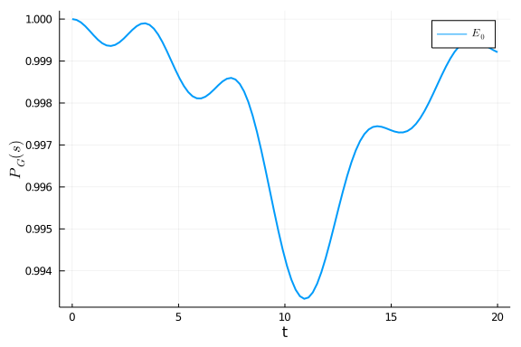

## Ohmic bath
We first create Ohmic bath with the following parameters

````julia
using QuantumAnnealingTools, OrdinaryDiffEq, Plots, Printf, LaTeXStrings

β = 4
T = β_2_temperature(β)
η = 0.1
fc= 10/(2π)
bath = Ohmic(η, fc, T)
````


````
Ohmic bath instance:
η (unitless): 0.1
ωc (GHz): 1.5915494309189535
T (mK): 1.9095587777458247
````


The spectrum $\gamma$ is plotted below:

````julia
plot(bath, :γ, range(0,10,length=100), linewidth=2, label="")
````


and the properties of the bath are

````julia
τsb, err_τsb = τ_SB((x)->correlation(x, bath))
@printf("τ_sb of the Ohmic bath is %.6f with error estimation %.2e \n", τsb, err_τsb)
````


````
τ_sb of the Ohmic bath is 0.666454 with error estimation 6.48e-09
````


````julia
τb, err_τb = τ_B((x)->correlation(x, bath), 100, τsb)
@printf("τ_b of the Ohmic bath is %.6f with error estimation %.2e \n", τb, err_τb)
````


````
τ_b of the Ohmic bath is 0.201395 with error estimation 1.91e-10
````


## Annealing

We define the annealing process as

````julia
Hp = 0.5*σz⊗σi - 0.7*σi⊗σz + 0.3*σz⊗σz
Hd = standard_driver(2)
H = DenseHamiltonian([(s)->1-s, (s)->s], [-Hd, Hp], unit=:ħ)
````


````
DenseHamiltonian with Complex{Float64}
with size: (4, 4)
````


The spectrum of the Hamiltonian during the evolution is
````julia
plot(H, range(0,1,length=100), 4, linewidth=2)
xlabel!("s")
ylabel!(L"P(s)")
````


### Closed system

We now run closed-system simulation

````julia
tf = 20
ρ0 = (σi+σx)⊗(σi+σx)/4
coupling = ConstantCouplings([σz⊗σi, σi⊗σz], unit=:ħ)
annealing = Annealing(H, ρ0, bath=bath, coupling=coupling)
close_sol = solve_von_neumann(annealing, tf, alg = Tsit5(), abstol=1e-6, reltol=1e-6);
````


The population of instantanous ground state is:

````julia
plot(close_sol, H, 1, range(0,tf,length=100), linewidth=2)
xlabel!("t")
ylabel!(L"P_G(s)")
````





The populations of the computational states are:

````julia
t_axis = range(0,tf,length=100)
p_computational_basis = [real(diag(close_sol(s))) for s in t_axis]
p_computational_basis = hcat(p_computational_basis...)
plot(t_axis, p_computational_basis', linewidth=2, label=[L"\rho_{00}" L"\rho_{11}" L"\rho_{22}" L"\rho_{33}"])
xlabel!("t")
ylabel!(L"\rho")
````


### Redfield equation

We solve the Redfield equation:

````julia
tf = 20
U = solve_unitary(annealing, tf, alg = Tsit5(), abstol=1e-7, reltol=1e-7);
redfield_sol = solve_redfield(annealing, tf, U, alg = Tsit5(), abstol=1e-7, reltol=1e-7);
````


We plot the populations of the computational states:

````julia
t_axis = range(0,tf,length=100)
p_computational_basis = [real(diag(redfield_sol(s))) for s in t_axis]
p_computational_basis = hcat(p_computational_basis...)
plot(t_axis, p_computational_basis', linewidth=2, label=[L"\rho_{00}" L"\rho_{11}" L"\rho_{22}" L"\rho_{33}"])
xlabel!("t")
ylabel!(L"\rho")
````


We can see that the density matrix becomes negative during the evolution.

### Positivity check

We can add a callback to stop the ODE solver when the density matrix become negative.

````julia
redfield_sol = solve_redfield(annealing, tf, U, alg = Tsit5(), abstol=1e-7, reltol=1e-7, callback=PositivityCheckCallback())
````


````
retcode: Terminated
Interpolation: specialized 4th order "free" interpolation
t: 38-element Array{Float64,1}:
 0.0
 9.999999999999999e-5
 0.0010999999999999998
 0.00786551568397621
 0.016932240388251633
 0.026303763546061412
 0.03727043304206125
 0.049257562452163145
 0.06292827203759598
 0.07875976726667351
 ⋮
 1.6713448602411505
 1.8638813298254504
 2.0645751797094887
 2.274212968610653
 2.4922159175945793
 2.7193240163467145
 2.9544081226732986
 3.19854539102924
 3.4527816734933183
u: 38-element Array{Array{Complex{Float64},2},1}:
 [0.25 + 0.0im 0.25 + 0.0im 0.25 + 0.0im 0.25 + 0.0im; 0.25 + 0.0im 0.25 + 
0.0im 0.25 + 0.0im 0.25 + 0.0im; 0.25 + 0.0im 0.25 + 0.0im 0.25 + 0.0im 0.2
5 + 0.0im; 0.25 + 0.0im 0.25 + 0.0im 0.25 + 0.0im 0.25 + 0.0im]
 [0.24999999999999667 + 0.0im 0.2499999499008545 + 4.99999901825347e-11im 0
.2499999499008645 - 9.999997925042628e-11im 0.24999989980172238 + 2.4999989
876830957e-11im; 0.2499999499008545 - 4.99999901825347e-11im 0.249999999999
995 + 0.0im 0.24999989980173237 - 1.4999993939261605e-10im 0.24999994990085
284 - 2.499999525814185e-11im; 0.2499999499008645 + 9.999997925042628e-11im
 0.24999989980173237 + 1.4999993939261605e-10im 0.250000000000015 + 0.0im 0
.24999994990086283 + 1.2499997419002007e-10im; 0.24999989980172238 - 2.4999
989876830957e-11im 0.24999994990085284 + 2.499999525814185e-11im 0.24999994
990086283 - 1.2499997419002007e-10im 0.24999999999999334 + 0.0im]
 [0.24999999999556358 + 0.0im 0.24999393848502027 + 6.049856360704342e-9im 
0.24999393849832896 - 1.2099696252661033e-8im 0.2499878771214445 + 3.024852
0933565355e-9im; 0.24999393848502027 - 6.049856360704342e-9im 0.24999999999
334538 + 0.0im 0.24998787713475293 - 1.814911255928721e-8im 0.2499939384828
0216 - 3.0249309249106878e-9im; 0.24999393849832896 + 1.2099696252661033e-8
im 0.24998787713475293 + 1.814911255928721e-8im 0.25000000001996386 + 0.0im
 0.24999393849611065 + 1.512462168836352e-8im; 0.2499878771214445 - 3.02485
20933565355e-9im 0.24999393848280216 + 3.0249309249106878e-9im 0.2499939384
9611065 - 1.512462168836352e-8im 0.24999999999112718 + 0.0im]
 [0.24999999837975584 + 0.0im 0.24969132975142425 + 3.0895766607105096e-7im
 0.2496913346058523 - 6.178723540238896e-7im 0.24938304222425808 + 1.542809
4688492337e-7im; 0.24969132975142425 - 3.0895766607105096e-7im 0.2499999975
694084 + 0.0im 0.2493830470804095 - 9.256856939283221e-7im 0.24969132894240
068 - 1.5448599665740338e-7im; 0.2496913346058523 + 6.178723540238896e-7im 
0.2493830470804095 + 9.256856939283221e-7im 0.25000000729141414 + 0.0im 0.2
4969133379625535 + 7.723440234396483e-7im; 0.24938304222425808 - 1.54280946
88492337e-7im 0.24969132894240068 + 1.5448599665740338e-7im 0.2496913337962
5535 - 7.723440234396483e-7im 0.24999999675942158 + 0.0im]
 [0.24999998388874467 + 0.0im 0.24859060513778264 + 1.4255873379703545e-6im
 0.24859065319919907 - 2.850255994697526e-6im 0.24718917159160642 + 7.08622
9842388839e-7im; 0.24859060513778264 - 1.4255873379703545e-6im 0.2499999758
2273706 + 0.0im 0.24718921975769031 - 4.251738485629021e-6im 0.248590597128
5693 - 7.129468101143465e-7im; 0.24859065319919907 + 2.850255994697526e-6im
 0.24718921975769031 + 4.251738485629021e-6im 0.25000007251518047 + 0.0im 0
.24859064517772647 + 3.5628965225007135e-6im; 0.24718917159160642 - 7.08622
9842388839e-7im 0.2485905971285693 + 7.129468101143465e-7im 0.2485906451777
2647 - 3.5628965225007135e-6im 0.24999996777333777 + 0.0im]
 [0.2499999399299207 + 0.0im 0.24668618944470977 + 3.4144978004254665e-6im 
0.24668636730601845 - 6.823685348711051e-6im 0.24341636107441625 + 1.683745
5457302144e-6im; 0.24668618944470977 - 3.4144978004254665e-6im 0.2499999098
015226 + 0.0im 0.24341653992297976 - 1.0102478474115962e-5im 0.246686159807
07753 - 1.708134188979452e-6im; 0.24668636730601845 + 6.823685348711051e-6i
m 0.24341653992297976 + 1.0102478474115962e-5im 0.2500002704460534 + 0.0im 
0.2466863375975447 + 8.530048959419607e-6im; 0.24341636107441625 - 1.683745
5457302144e-6im 0.24668615980707753 + 1.708134188979452e-6im 0.246686337597
5447 - 8.530048959419607e-6im 0.24999987982250327 + 0.0im]
 [0.2499998306336825 + 0.0im 0.243626702032026 + 6.7717475882394504e-6im 0.
24362719751451523 - 1.3522344561290953e-5im 0.2374160316205387 + 3.29612151
6099427e-6im; 0.243626702032026 - 6.7717475882394504e-6im 0.249999745422224
7 + 0.0im 0.2374165326436156 - 1.977675834392792e-5im 0.2436266194752317 - 
3.38940027970478e-6im; 0.24362719751451523 + 1.3522344561290953e-5im 0.2374
165326436156 + 1.977675834392792e-5im 0.2500007628880057 + 0.0im 0.24362711
467578574 + 1.690469186394774e-5im; 0.2374160316205387 - 3.296121516099427e
-6im 0.2436266194752317 + 3.38940027970478e-6im 0.24362711467578574 - 1.690
469186394774e-5im 0.24999966105608704 + 0.0im]
 [0.24999961384104594 + 0.0im 0.23951637520397617 + 1.1631933549508613e-5im
 0.23951748667756634 - 2.3200383422371203e-5im 0.22947269701460934 + 5.5619
38742935304e-6im; 0.23951637520397617 - 1.1631933549508613e-5im 0.249999418
6580527 + 0.0im 0.22947382960870774 - 3.3371747944010006e-5im 0.23951619002
947735 - 5.826552822403158e-6im; 0.23951748667756634 + 2.3200383422371203e-
5im 0.22947382960870774 + 3.3371747944010006e-5im 0.2500017406599985 + 0.0i
m 0.23951730065779062 + 2.9005764118729903e-5im; 0.22947269701460934 - 5.56
1938742935304e-6im 0.23951619002947735 + 5.826552822403158e-6im 0.239517300
65779062 - 2.9005764118729903e-5im 0.24999922684090284 + 0.0im]
 [0.2499992083063724 + 0.0im 0.23422939685490865 + 1.8571182097186175e-5im 
0.23423162783757406 - 3.697693691826501e-5im 0.21945423492125696 + 8.673995
858996071e-6im; 0.23422939685490865 - 1.8571182097186175e-5im 0.24999880542
23809 + 0.0im 0.21945653145195324 - 5.204435731894673e-5im 0.23422902521060
607 - 9.313180131653946e-6im; 0.23423162783757406 + 3.697693691826501e-5im 
0.21945653145195324 + 5.204435731894673e-5im 0.250003572472453 + 0.0im 0.23
423125399318892 + 4.62349387532704e-5im; 0.21945423492125696 - 8.6739958589
96071e-6im 0.23422902521060607 + 9.313180131653946e-6im 0.23423125399318892
 - 4.62349387532704e-5im 0.24999841379879367 + 0.0im]
 [0.24999848193109858 + 0.0im 0.2277971732680245 + 2.8299733764941282e-5im 
0.22780134092906937 - 5.6205029867506846e-5im 0.2075672008837808 + 1.283327
7214157671e-5im; 0.2277971732680245 - 2.8299733764941282e-5im 0.24999770176
659977 + 0.0im 0.20757154511921982 - 7.700079551639064e-5im 0.2277964791051
7015 - 1.4215659016653364e-5im; 0.22780134092906937 + 5.6205029867506846e-5
im 0.20757154511921982 + 7.700079551639064e-5im 0.2500068608887103 + 0.0im 
0.22780064152368015 + 7.028910412895256e-5im; 0.2075672008837808 - 1.283327
7214157671e-5im 0.22779647910517015 + 1.4215659016653364e-5im 0.22780064152
368015 - 7.028910412895256e-5im 0.24999695541359127 + 0.0im]
 ⋮
 [0.24792204918972702 + 0.0im 0.22614229334826388 + 0.009141702321136863im 
0.24727054966668507 - 0.009599467687634696im 0.21798083067554638 + 0.002825
5504625638536im; 0.22614229334826388 - 0.009141702321136863im 0.23309242437
46942 + 0.0im 0.2236292089975532 - 0.017763226373053817im 0.222810614677111
75 - 0.0061133709513677865im; 0.24727054966668507 + 0.009599467687634696im 
0.2236292089975532 + 0.017763226373053817im 0.27852346654073873 + 0.0im 0.2
4340395258651618 + 0.012612805673926046im; 0.21798083067554638 - 0.00282555
04625638536im 0.22281061467711175 + 0.0061133709513677865im 0.2434039525865
1618 - 0.012612805673926046im 0.24046205989483999 + 0.0im]
 [0.2477926053255275 + 0.0im 0.2258676285700631 + 0.010495019683078376im 0.
2538406714697557 - 0.010792545758447776im 0.22251077772999117 + 0.003203675
796229974im; 0.2258676285700631 - 0.010495019683078376im 0.2273165467606128
 + 0.0im 0.22887550776336937 - 0.020404554612864414im 0.22150445581236514 -
 0.007099178279177496im; 0.2538406714697557 + 0.010792545758447776im 0.2288
7550776336937 + 0.020404554612864414im 0.28681047956044753 + 0.0im 0.248702
75451372856 + 0.01416274413223864im; 0.22251077772999117 - 0.00320367579622
9974im 0.22150445581236514 + 0.007099178279177496im 0.24870275451372856 - 0
.01416274413223864im 0.23808036835341212 + 0.0im]
 [0.24769358397847832 + 0.0im 0.22422790736391715 + 0.011639263951965455im 
0.26008239763459334 - 0.011919290616851349im 0.2253506663841528 + 0.0035127
50935930277im; 0.22422790736391715 - 0.011639263951965455im 0.2205735768200
4852 + 0.0im 0.23237159762173437 - 0.022733121866993118im 0.218703183692983
33 - 0.007944130972831016im; 0.26008239763459334 + 0.011919290616851349im 0
.23237159762173437 + 0.022733121866993118im 0.29631135579708 + 0.0im 0.2534
763370476777 + 0.015572838770129119im; 0.2253506663841528 - 0.0035127509359
30277im 0.21870318369298333 + 0.007944130972831016im 0.2534763370476777 - 0
.015572838770129119im 0.2354214834043931 + 0.0im]
 [0.24755957713244017 + 0.0im 0.22150658572845872 + 0.012511720520977892im 
0.2662136865412015 - 0.012987893694865634im 0.22694579464354878 + 0.0037404
12874909909im; 0.22150658572845872 - 0.012511720520977892im 0.2129508378172
5035 + 0.0im 0.23459876882193417 - 0.024684021268505534im 0.214710640807984
1 - 0.008598787932615714im; 0.2662136865412015 + 0.012987893694865634im 0.2
3459876882193417 + 0.024684021268505534im 0.30703217332425764 + 0.0im 0.257
95578126779506 + 0.01683644001900915im; 0.22694579464354878 - 0.00374041287
4909909im 0.2147106408079841 + 0.008598787932615714im 0.25795578126779506 -
 0.01683644001900915im 0.23245741172605178 + 0.0im]
 [0.2472983519580842 + 0.0im 0.2179685646123892 + 0.013083498097317734im 0.
2723559082156405 - 0.014009145645186575im 0.22766121123221372 + 0.003882493
4147622682im; 0.2179685646123892 - 0.013083498097317734im 0.204631613107696
45 + 0.0im 0.23597007469967393 - 0.02623562336581652im 0.20982396237589274 
- 0.009040034519874411im; 0.2723559082156405 + 0.014009145645186575im 0.235
97007469967393 + 0.02623562336581652im 0.3189048310906174 + 0.0im 0.2622914
0307850257 + 0.017957142196730485im; 0.22766121123221372 - 0.00388249341476
22682im 0.20982396237589274 + 0.009040034519874411im 0.26229140307850257 - 
0.017957142196730485im 0.22916520384360195 + 0.0im]
 [0.24680090479436534 + 0.0im 0.21380216512832362 + 0.013375854961349175im 
0.2786039268928153 - 0.015005986890265265im 0.22776506696147714 + 0.0039454
15464336676im; 0.21380216512832362 - 0.013375854961349175im 0.1957712083435
3354 + 0.0im 0.23680669722002992 - 0.027431962260960226im 0.204256961442459
22 - 0.00928417123367158im; 0.2786039268928153 + 0.015005986890265265im 0.2
3680669722002992 + 0.027431962260960226im 0.3319335314213085 + 0.0im 0.2665
9890347738635 + 0.0189614388436018im; 0.22776506696147714 - 0.0039454154643
36676im 0.20425696144245922 + 0.00928417123367158im 0.26659890347738635 - 0
.0189614388436018im 0.2254943554407926 + 0.0im]
 [0.2459634883166489 + 0.0im 0.20916264225055012 + 0.013447396939781689im 0
.28494348694607957 - 0.015996143250113268im 0.227415939149793 + 0.003942598
186544164im; 0.20916264225055012 - 0.013447396939781689im 0.186585036384076
97 + 0.0im 0.2372991674457979 - 0.028350796281651484im 0.1982007754785463 -
 0.009376947663321845im; 0.28494348694607957 + 0.015996143250113268im 0.237
2991674457979 + 0.028350796281651484im 0.3460268587439749 + 0.0im 0.2708999
6792142723 + 0.01987920890048398im; 0.227415939149793 - 0.00394259818654416
4im 0.1982007754785463 + 0.009376947663321845im 0.27089996792142723 - 0.019
87920890048398im 0.22142461655529924 + 0.0im]
 [0.24469136963824695 + 0.0im 0.2041009786652283 + 0.013383651210785823im 0
.29138111399388444 - 0.017009984064359572im 0.2266848098340278 + 0.00389271
31938001967im; 0.2041009786652283 - 0.013383651210785823im 0.17716152071746
638 + 0.0im 0.23753254750367217 - 0.029108003661788385im 0.1917258600007616
4 - 0.00938518475222673im; 0.29138111399388444 + 0.017009984064359572im 0.2
3753254750367217 + 0.029108003661788385im 0.36124116348409796 + 0.0im 0.275
214200968334 + 0.020758921591130946im; 0.2266848098340278 - 0.0038927131938
001967im 0.19172586000076164 + 0.00938518475222673im 0.275214200968334 - 0.
020758921591130946im 0.21690594616018874 + 0.0im]
 [0.2429052406629345 + 0.0im 0.19861358798823284 + 0.01327397369931864im 0.
29790191810671135 - 0.01808286738386583im 0.22557911333857417 + 0.003815779
6038409166im; 0.19861358798823284 - 0.01327397369931864im 0.167534670904856
35 + 0.0im 0.2375026103925509 - 0.029826691438890867im 0.184845035298351 - 
0.00937795208934614im; 0.29790191810671135 + 0.01808286738386583im 0.237502
6103925509 + 0.029826691438890867im 0.3776671806178616 + 0.0im 0.2795334438
51181 + 0.021656108687892774im; 0.22557911333857417 - 0.0038157796038409166
im 0.184845035298351 + 0.00937795208934614im 0.279533443851181 - 0.02165610
8687892774im 0.21189290781434758 + 0.0im]
````


