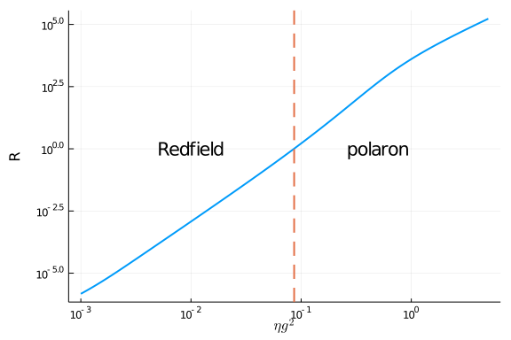
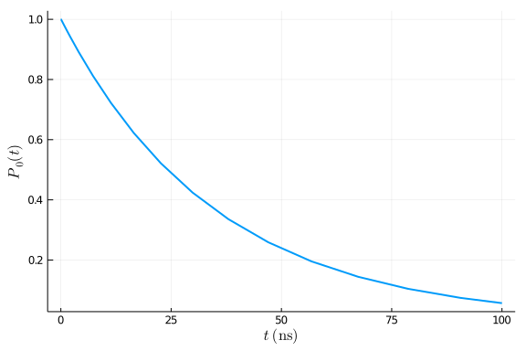
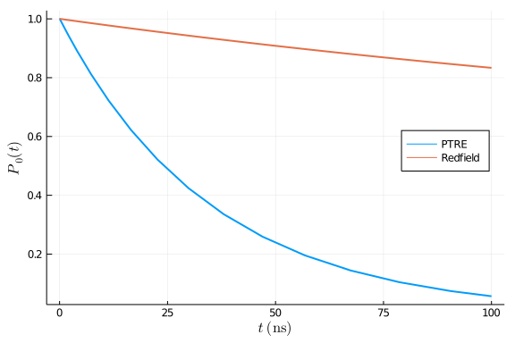
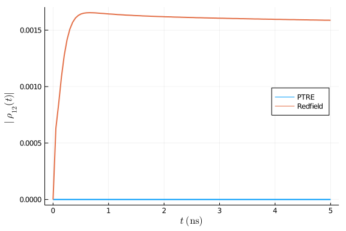

## Correlation function in polaron frame
This is an tutorial for using polaron transformed Redfield equation (PTRE) in OSQAT. For more details on PTRE, [Xu and Cao](https://link.springer.com/article/10.1007%2Fs11467-016-0540-2) is a good reference.

In this example, we solve both Redfield equation and PTRE for a single qubit model with system Hamiltonian

$$H_\mathrm{S}=\epsilon \sigma_z + \Delta \sigma_x$$

coupling to an Ohmic bath via $\sigma_z$ interaction

$$H = H_\mathrm{S} + \sigma_z \otimes B + H_\mathrm{B}\ .$$

Loosely speaking, the main difference between these two approaches is, they have different types of correlation functions. For Redfield equation, we have the normal bath correlation function

$$C(t_1, t_2) = \langle B(t_1)B(t_2) \rangle \ .$$

In the polaron frame, however, the bath correlation function becomes

$$K(t_1, t_2) = \exp\Big\{ -4 \int_0^t \int_{-\infty}^{0}C(t_1, t_2) \mathrm{d}t_1 \mathrm{d}t_2 \Big\} \ .$$
Again, interested reader can refer to [[Amin and Averin]](https://link.aps.org/doi/10.1103/PhysRevLett.100.197001) and [Leggett et al](https://link.aps.org/doi/10.1103/RevModPhys.59.1) for more details.

### Error bound on the second order master equation

The simplest thing we can do is to compare the error bounds given in [Mozgunov and Lidar](https://quantum-journal.org/papers/q-2020-02-06-227/) between Redfield and PTRE. We define the error scaling parameter as

$$error = \frac{\tau_\mathrm{B}}{\tau_\mathrm{SB}} \ ,$$

then we compare the error ration between Redfield and PTRE

$$R = \frac{error_{\mathrm{Redfield}}}{error_{\mathrm{PTRE}}} \ ,$$

when fixing other parameters in the Ohmic bath.
````julia

using OrdinaryDiffEq, QuantumAnnealingTools, Plots
using LaTeXStrings

function err_bound(tf, cfun)
    tsb, esb = τ_SB(cfun)
    tb, eb = τ_B(cfun, tf, tsb)
    tb / tsb
end

fc = 4; T =12; tf = 1000;
ηlist = log_uniform(1e-3, 5, 1000)
err_ratio = []
err_clist = []
err_klist = []
for η in ηlist
    bath = Ohmic(η, fc, T)
    cfun = (x)->correlation(x, bath)
    pfun = (x)->polaron_correlation(x, bath)
    err_c = err_bound(tf, cfun)
    err_k = err_bound(tf, pfun)
    push!(err_clist, err_c)
    push!(err_klist, err_k)
    push!(err_ratio, err_c/err_k)
end
idx = findfirst((x)->x>=1, err_ratio)
plot(ηlist, err_ratio, xscale=:log10, yscale=:log10, label="", linewidth=2)
vline!([ηlist[idx]], label="", linestyle=:dash, linewidth=2)
annotate!([(0.5, 1.0, Plots.text("polaron")), (0.01, 1.0, Plots.text("Redfield"))])
xlabel!(L"\eta g^2")
ylabel!("R")
````





From above figure we can see that, as the system-bath coupling strength is bigger than $10^{-1}$, PTRE should have better error scaling than the usual form of Redfield equation. We also plot the corresponding error values for both Redfield and PTRE:

````julia

plot(ηlist, err_clist, xscale=:log10, yscale=:log10, label="Redfield", linewidth=2)
plot!(ηlist, err_klist, xscale=:log10, yscale=:log10, label="PTRE", linewidth=2)
xlabel!(L"\eta g^2")
ylabel!("error")
````





Above figure confirms that the range of applicability of Redfield and PTRE are weak and strong coupling regime respectively.

### Solving PTRE

Since PTRE and the Redfield equation have identical forms, `solve_redfield` can also be used for PTRE. To see this, let's first write down the PTRE for our example.

$$\dot{\rho}_\mathrm{S} = \epsilon σ_z + [ \sigma_i, \Lambda_i(t) \rho_\mathrm{S}(t) ] + h.c.$$

where $i,j \in [+, -]$, $i \neq j$ and

$$\Lambda_i(t)=\Delta^2 \int_0^{t} K(t-\tau)U(t,\tau) \sigma_j U^\dagger(t,\tau) \mathrm{d}\tau \ .$$

From above equations, it is clear that the following steps are needed to define an annealing process in polaron frame:
1. define a new Hamiltonian $H = \epsilon σ_z$;
2. define new coupling operators $\sigma_-$ and $\sigma_+$;
3. define new correlated bath with two-point correlation $K_{i,j}(t_1, t_2)$;

The following code block illustrates how these can be done in OSQAT

````julia

    # assume ϵ = 1
    const Δ = 0.1 
    # define the Ohmic bath in polaron transformed frame
    η = 0.5; bath = Ohmic(η, fc, T)
    K(t1, t2) = Δ^2 * polaron_correlation(t1-t2, bath)
    cfun = [nothing K; K nothing]
    pbath = CorrelatedBath(((1,2),(2,1)), correlation=cfun)
    # define coupling as σ+ and σ- operators
    σp = [0 1;0 0.0im]; σm = [0 0;1 0.0im]
    coupling = ConstantCouplings([σp, σm])
    # manually define the unitary operator
    U(t) = exp(-2.0im * π * σz * t)
    H = DenseHamiltonian([(s)->1.0], [σz])
    u0 = PauliVec[3][1]
    annealing = Annealing(H, u0, coupling = coupling, bath = pbath)
    tf = 100
    sol_ptre = solve_redfield(annealing, tf, U, alg=Tsit5(), Ta=2, reltol=1e-5)
    pop_e = [real(s[1,1]) for s in sol_ptre.u]
    plot(sol_ptre.t, pop_e, xlabel=L"t\ (\mathrm{ns})", ylabel=L"P_0(t)", label="", linewidth = 2)
````


For historical reasons, this is know as an example of the "incoherent tunneling". The off-diagonal elements of the density matrix in computational bases(Z-bases) during the entire evolution is 0(, which is shown in next section).

### Redfield equation

What would happened to normal Redfield equation in this regime? We can also try

````julia

H = DenseHamiltonian([(s)->1.0], [σz+0.1*σx])
coupling = ConstantCouplings(["Z"])
annealing = Annealing(H, u0, coupling = coupling, bath = bath)
tf = 100
sol_redfield = solve_redfield(annealing, tf, U, alg=Tsit5(), Ta=40, reltol=1e-5, callback=PositivityCheckCallback())
pop_e_redfield = [real(s[1,1]) for s in sol_redfield.u]
plot(sol_ptre.t, pop_e, xlabel=L"t\ (\mathrm{ns})", ylabel=L"P_0(t)", label="PTRE", linewidth = 2, legend = :right)
plot!(sol_redfield.t, pop_e_redfield, xlabel=L"t\ (\mathrm{ns})", ylabel=L"P_0(t)", label="Redfield", linewidth = 2)
````





PTRE gives a much stronger decay than the Redfield equation for the parameters chosen in this example. One can also verify the amplitude of the off-diagonal elements during the evolution. Unlike PTRE, the usual Redfield equation have non-vanishing off-diagonal elements of the density matrix.

````julia

t_axis = range(0, 5, length=100)
off_diag_ptre = [abs(sol_ptre(t)[1,2]) for t in t_axis]
off_diag_redfield = [abs(sol_redfield(t)[1,2]) for t in t_axis]
plot(t_axis, off_diag_ptre, xlabel=L"t\ (\mathrm{ns})", ylabel=L"\lvert \rho_{12} \rvert|(t)", label="PTRE", linewidth = 2, legend=:right)
plot!(t_axis, off_diag_redfield, xlabel=L"t\ (\mathrm{ns})", ylabel=L"|\rho_{12}(t)|", label="Redfield", linewidth = 2)
````



