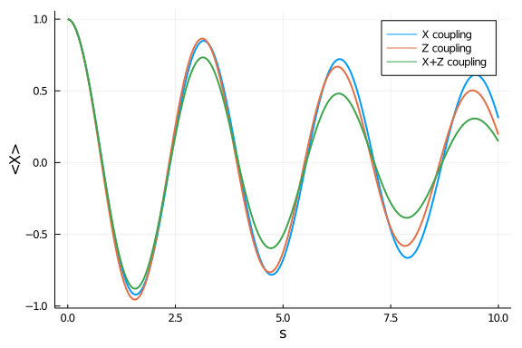
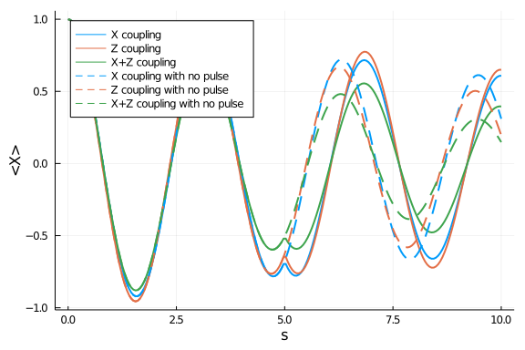

## Redfield equation with multi-axis couplings
In this example, we show how to solve the Redfield equation with the following Hamiltonian

$$H(s) = - \sigma_z + \sigma_x \otimes B_1 + \sigma_z \otimes B_2 + H_\mathrm{B} \ ,$$

where $B_1$​ and $B_2$​ are independent Ohmic bath with different cutoff frequencies.

### Define annealing

First, we need to combine `AbstractCouplings` with `AbstractBath` into an `Interaction` object. Then we combine different interactions into an `InteractionSet`:

```julia
using OrdinaryDiffEq, OpenQuantumTools, Plots

coupling_1 = ConstantCouplings(["X"])
bath_1 = Ohmic(1e-4, 4, 16)
interaction_1 = Interaction(coupling_1, bath_1)

coupling_2 = ConstantCouplings(["Z"])
bath_2 = Ohmic(1e-4, 0.1, 16)
interaction_2 = Interaction(coupling_2, bath_2)

interaction_set = InteractionSet(interaction_1, interaction_2);
```


Finally, we can create an`Annealing` object with `InteractionSet` instead of coupling and bath:
```julia
H = DenseHamiltonian([(s) -> 1.0], -[σz], unit = :ħ)
u0 = PauliVec[1][1]
annealing_1 = Annealing(H, u0, coupling=coupling_1, bath = bath_1)
annealing_2 = Annealing(H, u0, coupling=coupling_2, bath = bath_2)
annealing = Annealing(H, u0, interactions=interaction_set)
```

```
Annealing with hType QTBase.DenseHamiltonian{Complex{Float64}} and uType Ar
ray{Complex{Float64},1}
u0 with size: (2,)
```


### Solve Redfield equation

We solve the Redfield equation with $X$, $Z$, and $X$ plus $Z$ couplings:

```julia
tf = 10
# Generate the unitary first
U = solve_unitary(annealing, tf, alg=Tsit5(), reltol=1e-6)
# tag the unitary so the solver know it has inplace update method
# this will speed up the calculation of integral
U = InplaceUnitary(U)
 # Solve the Redfield equation
sol_1 = solve_redfield(annealing_1, tf, U, alg = Tsit5(), abstol = 1e-6, reltol = 1e-6)
sol_2 = solve_redfield(annealing_2, tf, U, alg = Tsit5(), abstol = 1e-6, reltol = 1e-6)
sol = solve_redfield(annealing, tf, U, alg = Tsit5(), abstol = 1e-6, reltol = 1e-6)
```


We plot $\langle X \rangle$ for the above three cases:

```julia
t_list = range(0,tf,length=200)
x_nopulse = []
z_nopulse = []
xz_nopulse = []
for s in t_list
    push!(x_nopulse, real(tr(σx*sol_1(s))))
    push!(z_nopulse, real(tr(σx*sol_2(s))))
    push!(xz_nopulse, real(tr(σx*sol(s))))
end
plot(t_list, x_nopulse, linewidth=2, label="X coupling")
plot!(t_list, z_nopulse, linewidth=2, label="Z coupling")
plot!(t_list, xz_nopulse, linewidth=2, label="X+Z coupling")
xlabel!("s")
ylabel!("<X>")
```




### Instantaneous pulses

In the last section, we run the same simulation with a single $X$ pulse in the middle of the evolution (spin echo). The can be done by creating a Callback object and feed it to the solver. For ideal pulses, we can use the built-in function `InstPulseCallback`. This has similar effects as the dynamical decoupling (except the pulse does not commute with the system Hamiltonian).

```julia
# in this example, we apply an Z pulse in the middle of the annealing
# for the InstPulseCallback constructor
# the first argument is a list of times where the pulses are applied
# the second argument is a function to update the state update!(c, pulse_index
# the function will update the state c with give pulse_index
cbu = InstPulseCallback([0.5 * tf], (c, x) -> c .= σx * c)
cb = InstPulseCallback([0.5 * tf], (c, x) -> c .= σx * c * σx)
annealing_1 = Annealing(H, u0, coupling = coupling_1, bath = bath_1)
annealing_2 = Annealing(H, u0, coupling=coupling_2, bath = bath_2)
annealing = Annealing(H, u0, interactions=interaction_set)

tf = 10
U = solve_unitary(annealing, tf, alg=Tsit5(), reltol=1e-6, callback = cbu);
U = InplaceUnitary(U)
```


```julia
sol_1 = solve_redfield(annealing_1, tf, U, alg = Tsit5(), reltol = 1e-6, callback=cb)
sol_2 = solve_redfield(annealing_2, tf, U, alg = Tsit5(), reltol = 1e-6, callback=cb)
sol = solve_redfield(annealing, tf, U, alg = Tsit5(), reltol = 1e-6, callback=cb);
t_list = range(0,tf,length=200)
x_pulse = []
z_pulse = []
xz_pulse = []
for s in t_list
    push!(x_pulse, real(tr(σx*sol_1(s))))
    push!(z_pulse, real(tr(σx*sol_2(s))))
    push!(xz_pulse, real(tr(σx*sol(s))))
end
plot(t_list, x_pulse, linewidth=2, label="X coupling", legend=:topleft, color=1)
plot!(t_list, z_pulse, linewidth=2, label="Z coupling", color=2)
plot!(t_list, xz_pulse, linewidth=2, label="X+Z coupling", color=3)
plot!(t_list, x_nopulse, linewidth=2, linestyle=:dash, label="X coupling with no pulse", color=1)
plot!(t_list, z_nopulse, linewidth=2, linestyle=:dash, label="Z coupling with no pulse", color=2)
plot!(t_list, xz_nopulse, linewidth=2, linestyle=:dash, label="X+Z coupling with no pulse", color=3)
xlabel!("s")
ylabel!("<X>")
```




We can see that the echo pulse slightly reduced the envelope's decay rate for the case where $Z$ coupling is present.